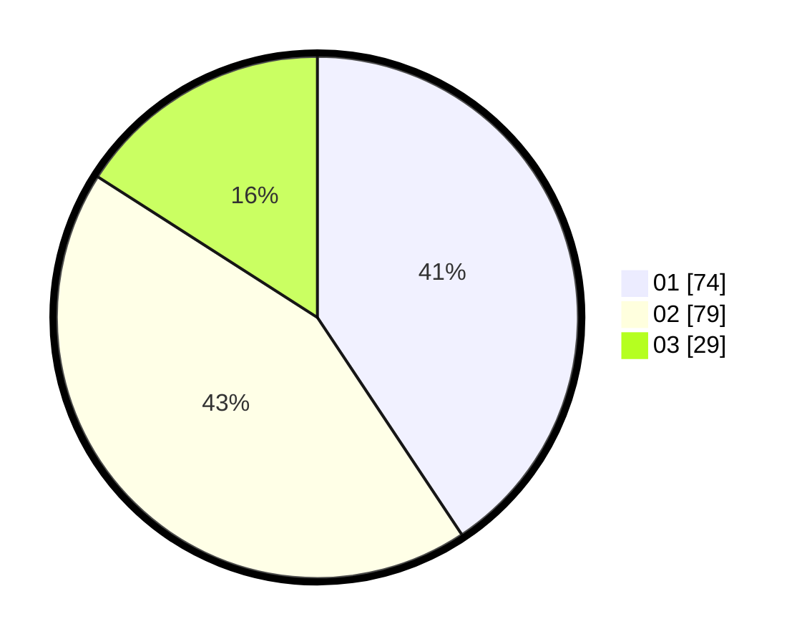

# Hasil

Hasil perolehan suara paslon dapat dilihat pada file paslon-01.txt, paslon-02.txt, dan paslon-03.txt.

Jika tidak ada, artinya data tersebut belum ada pada SIREKAP.

## Perolehan Suara

 * Paslon 01: **74**.
 * Paslon 02: **79**.
 * Paslon 03: **29**.

## Foto C Plano

https://sirekap-obj-formc.kpu.go.id/3765/pemilu/ppwp/31/74/04/10/03/3174041003030-20240214-190719--a177d733-e4b5-4dd8-a13a-a54c7628e605.jpg

https://sirekap-obj-formc.kpu.go.id/3765/pemilu/ppwp/31/74/04/10/03/3174041003030-20240214-191311--29825560-45a6-4dff-be4e-363141b1c4bc.jpg

https://sirekap-obj-formc.kpu.go.id/3765/pemilu/ppwp/31/74/04/10/03/3174041003030-20240214-190444--fcb45d51-6e40-4e04-b8da-100d735eb59a.jpg

## DATA PEMILIH TETAP

Jumlah pemilih dalam DPT: **221**.
 * L: **105**.
 * P: **116**.

## DATA PENGGUNA HAK PILIH

Jumlah pengguna hak pilih dalam DPT: **173**.
 * L: **79**.
 * P: **94**.

Jumlah pengguna hak pilih dalam DPTb: **7**.
 * L: **3**.
 * P: **4**.

Jumlah pengguna hak pilih dalam DPK: **3**.
 * L: **2**.
 * P: **1**.

Jumlah pengguna hak pilih: **183**.
 * L: **84**.
 * P: **99**.

## JUMLAH SUARA SAH DAN TIDAK SAH

JUMLAH SELURUH SUARA SAH: **182**.

JUMLAH SUARA TIDAK SAH: **1**.

JUMLAH SELURUH SUARA SAH DAN SUARA TIDAK SAH: **183**.
