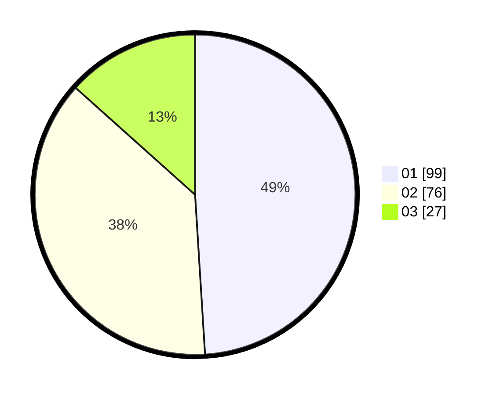

# Hasil

Hasil perolehan suara paslon dapat dilihat pada file paslon-01.txt, paslon-02.txt, dan paslon-03.txt.

Jika tidak ada, artinya data tersebut belum ada pada SIREKAP.

## Perolehan Suara

 * Paslon 01: **99**.
 * Paslon 02: **76**.
 * Paslon 03: **27**.

## Foto C Plano

https://sirekap-obj-formc.kpu.go.id/3cdd/pemilu/ppwp/31/74/04/10/03/3174041003034-20240214-155616--e79a878b-8489-4b53-a11e-5e273dd9dce2.jpg

https://sirekap-obj-formc.kpu.go.id/3cdd/pemilu/ppwp/31/74/04/10/03/3174041003034-20240215-004729--30aaac70-d5d4-4712-8e99-42ee296b7618.jpg

https://sirekap-obj-formc.kpu.go.id/3cdd/pemilu/ppwp/31/74/04/10/03/3174041003034-20240214-155628--09d5819a-99b7-45da-b4c5-31af63b7c260.jpg

## DATA PEMILIH TETAP

Jumlah pemilih dalam DPT: **254**.
 * L: **123**.
 * P: **131**.

## DATA PENGGUNA HAK PILIH

Jumlah pengguna hak pilih dalam DPT: **193**.
 * L: **92**.
 * P: **101**.

Jumlah pengguna hak pilih dalam DPTb: **12**.
 * L: **6**.
 * P: **6**.

Jumlah pengguna hak pilih dalam DPK: **1**.
 * L: **1**.
 * P: **0**.

Jumlah pengguna hak pilih: **206**.
 * L: **99**.
 * P: **107**.

## JUMLAH SUARA SAH DAN TIDAK SAH

JUMLAH SELURUH SUARA SAH: **202**.

JUMLAH SUARA TIDAK SAH: **4**.

JUMLAH SELURUH SUARA SAH DAN SUARA TIDAK SAH: **206**.
