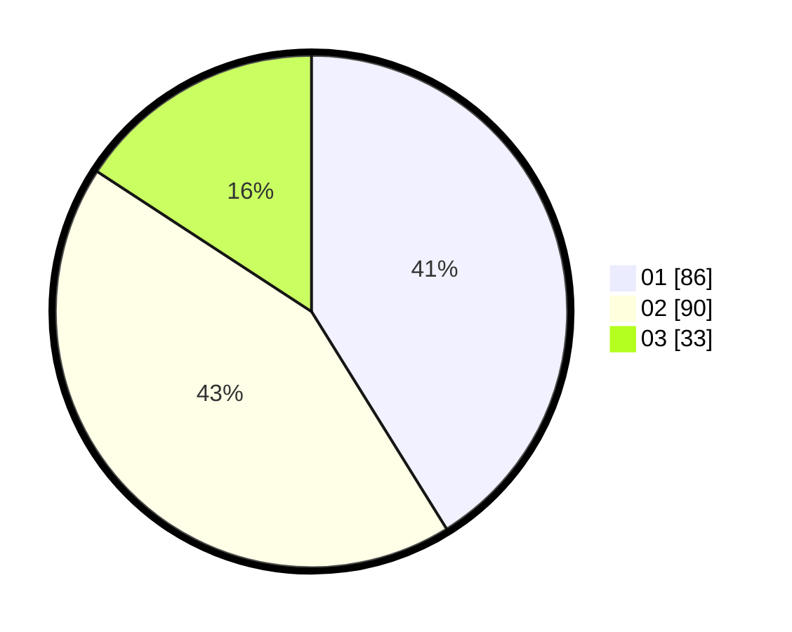

# Hasil

Hasil perolehan suara paslon dapat dilihat pada file paslon-01.txt, paslon-02.txt, dan paslon-03.txt.

Jika tidak ada, artinya data tersebut belum ada pada SIREKAP.

## Perolehan Suara

 * Paslon 01: **86**.
 * Paslon 02: **90**.
 * Paslon 03: **33**.

## Foto C Plano

https://sirekap-obj-formc.kpu.go.id/665d/pemilu/ppwp/31/74/04/10/03/3174041003035-20240215-171621--843704fa-e59c-460e-ba8a-daf0d0dd6fda.jpg

https://sirekap-obj-formc.kpu.go.id/665d/pemilu/ppwp/31/74/04/10/03/3174041003035-20240215-171650--c3475937-788c-4773-9d86-a81c261b7eab.jpg

https://sirekap-obj-formc.kpu.go.id/665d/pemilu/ppwp/31/74/04/10/03/3174041003035-20240215-171639--894042cc-0d40-483b-8469-4e1815854288.jpg

## DATA PEMILIH TETAP

Jumlah pemilih dalam DPT: **245**.
 * L: **106**.
 * P: **139**.

## DATA PENGGUNA HAK PILIH

Jumlah pengguna hak pilih dalam DPT: **198**.
 * L: **84**.
 * P: **114**.

Jumlah pengguna hak pilih dalam DPTb: **13**.
 * L: **6**.
 * P: **7**.

Jumlah pengguna hak pilih dalam DPK: **1**.
 * L: **0**.
 * P: **1**.

Jumlah pengguna hak pilih: **212**.
 * L: **90**.
 * P: **122**.

## JUMLAH SUARA SAH DAN TIDAK SAH

JUMLAH SELURUH SUARA SAH: **209**.

JUMLAH SUARA TIDAK SAH: **3**.

JUMLAH SELURUH SUARA SAH DAN SUARA TIDAK SAH: **212**.
