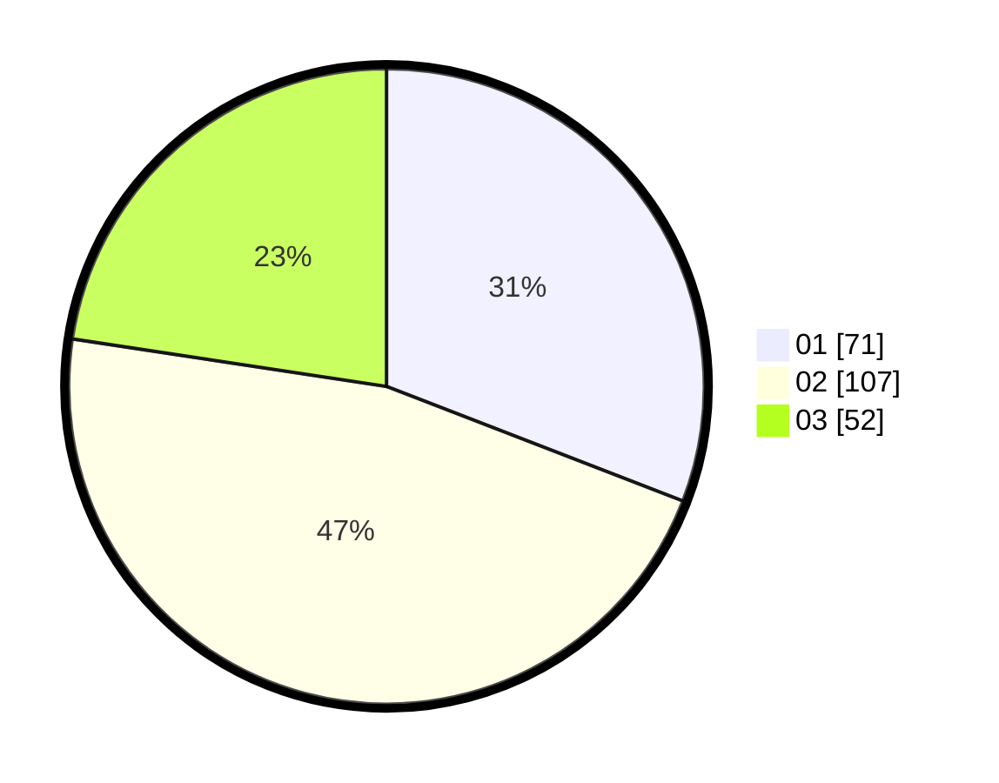

# Hasil

Hasil perolehan suara paslon dapat dilihat pada file paslon-01.txt, paslon-02.txt, dan paslon-03.txt.

Jika tidak ada, artinya data tersebut belum ada pada SIREKAP.

## Perolehan Suara

 * Paslon 01: **71**.
 * Paslon 02: **107**.
 * Paslon 03: **52**.

## Foto C Plano

https://sirekap-obj-formc.kpu.go.id/f262/pemilu/ppwp/31/74/04/10/03/3174041003040-20240215-003857--2fcbafe5-3eb8-4d11-be59-e647bb24eee1.jpg

https://sirekap-obj-formc.kpu.go.id/f262/pemilu/ppwp/31/74/04/10/03/3174041003040-20240215-003928--1ef8d19d-f092-40f9-8b62-0ae0378d0d40.jpg

https://sirekap-obj-formc.kpu.go.id/f262/pemilu/ppwp/31/74/04/10/03/3174041003040-20240215-003957--48a83b76-d48e-45b0-a05b-4e0066ee274b.jpg

## DATA PEMILIH TETAP

Jumlah pemilih dalam DPT: **260**.
 * L: **148**.
 * P: **112**.

## DATA PENGGUNA HAK PILIH

Jumlah pengguna hak pilih dalam DPT: **221**.
 * L: **120**.
 * P: **101**.

Jumlah pengguna hak pilih dalam DPTb: **6**.
 * L: **1**.
 * P: **5**.

Jumlah pengguna hak pilih dalam DPK: **4**.
 * L: **3**.
 * P: **1**.

Jumlah pengguna hak pilih: **231**.
 * L: **124**.
 * P: **107**.

## JUMLAH SUARA SAH DAN TIDAK SAH

JUMLAH SELURUH SUARA SAH: **230**.

JUMLAH SUARA TIDAK SAH: **2**.

JUMLAH SELURUH SUARA SAH DAN SUARA TIDAK SAH: **232**.
