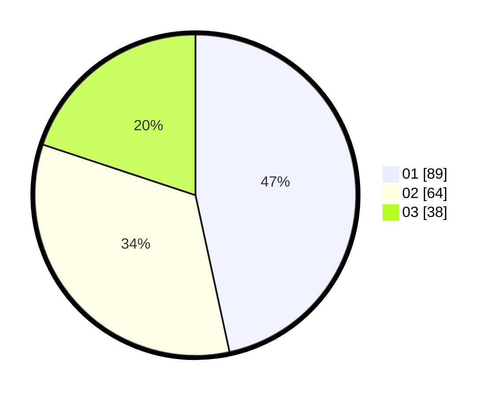

# Hasil

Hasil perolehan suara paslon dapat dilihat pada file paslon-01.txt, paslon-02.txt, dan paslon-03.txt.

Jika tidak ada, artinya data tersebut belum ada pada SIREKAP.

## Perolehan Suara

 * Paslon 01: **89**.
 * Paslon 02: **64**.
 * Paslon 03: **38**.

## Foto C Plano

https://sirekap-obj-formc.kpu.go.id/3c16/pemilu/ppwp/31/74/04/10/03/3174041003042-20240214-202359--d9c5015a-4171-4e88-8de8-7ebad30c164c.jpg

https://sirekap-obj-formc.kpu.go.id/3c16/pemilu/ppwp/31/74/04/10/03/3174041003042-20240214-202413--e8207462-94d8-43e8-9164-be4301d9d2a8.jpg

https://sirekap-obj-formc.kpu.go.id/3c16/pemilu/ppwp/31/74/04/10/03/3174041003042-20240214-202426--3e3217df-7b2e-4a25-a0c8-c9c6aec1119d.jpg

## DATA PEMILIH TETAP

Jumlah pemilih dalam DPT: **236**.
 * L: **113**.
 * P: **123**.

## DATA PENGGUNA HAK PILIH

Jumlah pengguna hak pilih dalam DPT: **185**.
 * L: **93**.
 * P: **92**.

Jumlah pengguna hak pilih dalam DPTb: **10**.
 * L: **7**.
 * P: **3**.

Jumlah pengguna hak pilih dalam DPK: **0**.
 * L: **0**.
 * P: **0**.

Jumlah pengguna hak pilih: **195**.
 * L: **100**.
 * P: **95**.

## JUMLAH SUARA SAH DAN TIDAK SAH

JUMLAH SELURUH SUARA SAH: **191**.

JUMLAH SUARA TIDAK SAH: **4**.

JUMLAH SELURUH SUARA SAH DAN SUARA TIDAK SAH: **195**.
