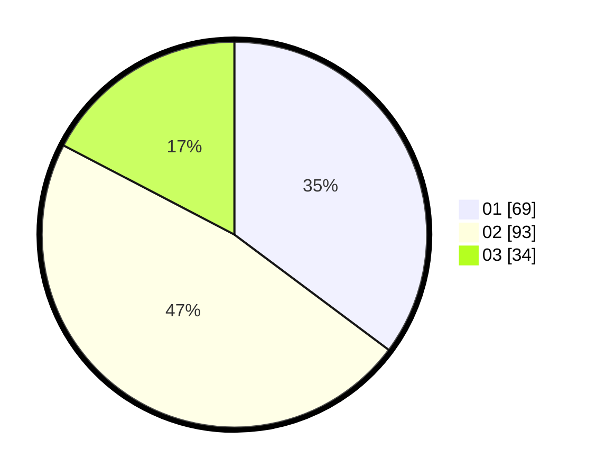

# Hasil

Hasil perolehan suara paslon dapat dilihat pada file paslon-01.txt, paslon-02.txt, dan paslon-03.txt.

Jika tidak ada, artinya data tersebut belum ada pada SIREKAP.

## Perolehan Suara

 * Paslon 01: **69**.
 * Paslon 02: **93**.
 * Paslon 03: **34**.

## Foto C Plano

https://sirekap-obj-formc.kpu.go.id/ca9d/pemilu/ppwp/31/74/04/10/03/3174041003046-20240214-190803--f3174ddb-b099-488d-a05f-b34511cfacfe.jpg

https://sirekap-obj-formc.kpu.go.id/ca9d/pemilu/ppwp/31/74/04/10/03/3174041003046-20240214-190041--314468bd-d3f7-43d3-a037-04ebd1e280df.jpg

https://sirekap-obj-formc.kpu.go.id/ca9d/pemilu/ppwp/31/74/04/10/03/3174041003046-20240214-184833--d229c3f0-adf1-4107-a12b-31e7c602a834.jpg

## DATA PEMILIH TETAP

Jumlah pemilih dalam DPT: **249**.
 * L: **117**.
 * P: **132**.

## DATA PENGGUNA HAK PILIH

Jumlah pengguna hak pilih dalam DPT: **181**.
 * L: **86**.
 * P: **95**.

Jumlah pengguna hak pilih dalam DPTb: **20**.
 * L: **16**.
 * P: **4**.

Jumlah pengguna hak pilih dalam DPK: **4**.
 * L: **1**.
 * P: **3**.

Jumlah pengguna hak pilih: **205**.
 * L: **103**.
 * P: **102**.

## JUMLAH SUARA SAH DAN TIDAK SAH

JUMLAH SELURUH SUARA SAH: **196**.

JUMLAH SUARA TIDAK SAH: **9**.

JUMLAH SELURUH SUARA SAH DAN SUARA TIDAK SAH: **205**.
