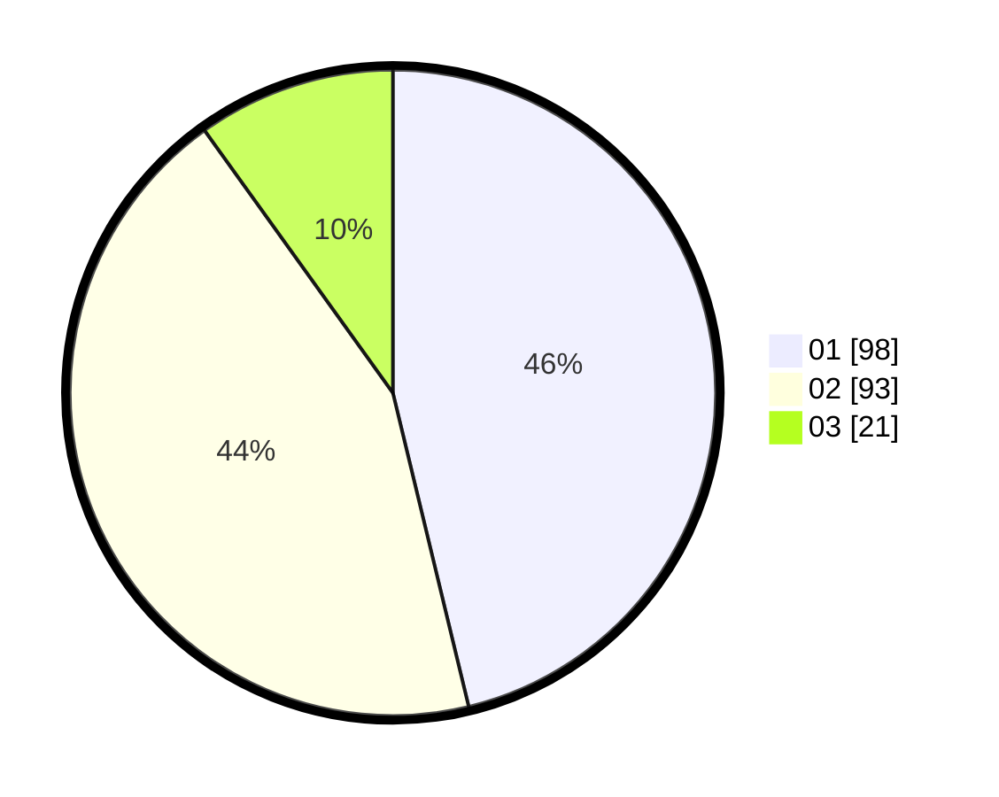

# Hasil

Hasil perolehan suara paslon dapat dilihat pada file paslon-01.txt, paslon-02.txt, dan paslon-03.txt.

Jika tidak ada, artinya data tersebut belum ada pada SIREKAP.

## Perolehan Suara

 * Paslon 01: **98**.
 * Paslon 02: **93**.
 * Paslon 03: **21**.

## Foto C Plano

https://sirekap-obj-formc.kpu.go.id/df61/pemilu/ppwp/31/74/04/10/03/3174041003047-20240214-202720--9261845d-85af-4294-a7e0-782340ef8c1f.jpg

https://sirekap-obj-formc.kpu.go.id/df61/pemilu/ppwp/31/74/04/10/03/3174041003047-20240214-202945--e44b8cb7-9d97-4542-a88e-f81dfbdb4028.jpg

https://sirekap-obj-formc.kpu.go.id/df61/pemilu/ppwp/31/74/04/10/03/3174041003047-20240214-203115--d7dfa4cd-d8b8-4036-8b72-b72e7660441c.jpg

## DATA PEMILIH TETAP

Jumlah pemilih dalam DPT: **261**.
 * L: **127**.
 * P: **134**.

## DATA PENGGUNA HAK PILIH

Jumlah pengguna hak pilih dalam DPT: **204**.
 * L: **89**.
 * P: **115**.

Jumlah pengguna hak pilih dalam DPTb: **7**.
 * L: **4**.
 * P: **3**.

Jumlah pengguna hak pilih dalam DPK: **3**.
 * L: **1**.
 * P: **2**.

Jumlah pengguna hak pilih: **214**.
 * L: **94**.
 * P: **120**.

## JUMLAH SUARA SAH DAN TIDAK SAH

JUMLAH SELURUH SUARA SAH: **211**.

JUMLAH SUARA TIDAK SAH: **3**.

JUMLAH SELURUH SUARA SAH DAN SUARA TIDAK SAH: **214**.
