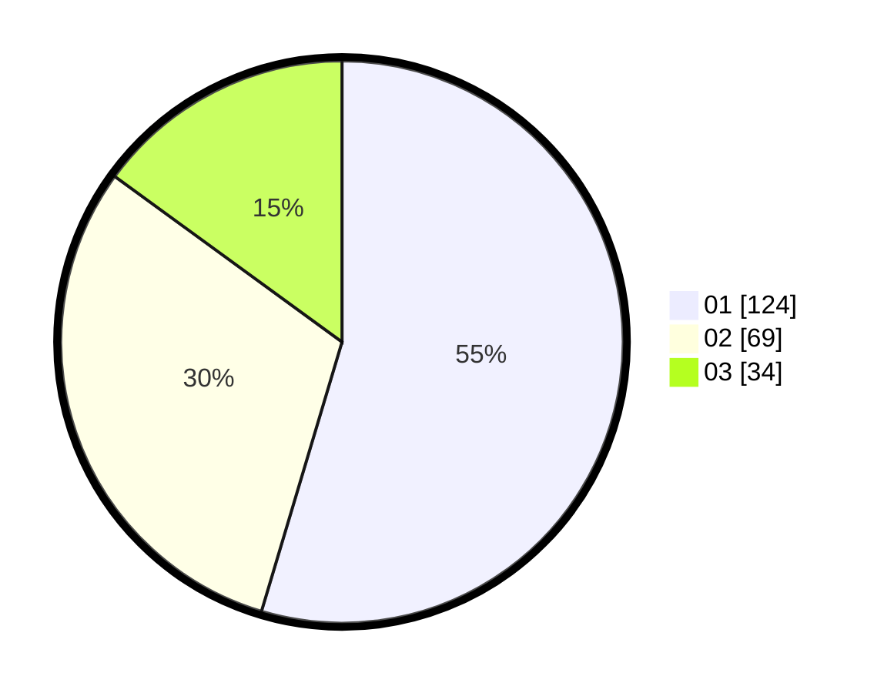

# Hasil

Hasil perolehan suara paslon dapat dilihat pada file paslon-01.txt, paslon-02.txt, dan paslon-03.txt.

Jika tidak ada, artinya data tersebut belum ada pada SIREKAP.

## Perolehan Suara

 * Paslon 01: **124**.
 * Paslon 02: **69**.
 * Paslon 03: **34**.

## Foto C Plano

https://sirekap-obj-formc.kpu.go.id/7ab7/pemilu/ppwp/31/74/04/10/03/3174041003051-20240214-155920--ad4fbb45-f62c-415e-8b35-b2b8a3a863b6.jpg

https://sirekap-obj-formc.kpu.go.id/7ab7/pemilu/ppwp/31/74/04/10/03/3174041003051-20240214-193832--9dc4ac7d-fc4b-4df0-bf4d-d991f2db790d.jpg

https://sirekap-obj-formc.kpu.go.id/7ab7/pemilu/ppwp/31/74/04/10/03/3174041003051-20240214-193847--950eefd3-d81f-4fe7-b115-b3f5fb2a0a5c.jpg

## DATA PEMILIH TETAP

Jumlah pemilih dalam DPT: **258**.
 * L: **121**.
 * P: **137**.

## DATA PENGGUNA HAK PILIH

Jumlah pengguna hak pilih dalam DPT: **219**.
 * L: **103**.
 * P: **116**.

Jumlah pengguna hak pilih dalam DPTb: **7**.
 * L: **5**.
 * P: **2**.

Jumlah pengguna hak pilih dalam DPK: **1**.
 * L: **1**.
 * P: **0**.

Jumlah pengguna hak pilih: **227**.
 * L: **109**.
 * P: **118**.

## JUMLAH SUARA SAH DAN TIDAK SAH

JUMLAH SELURUH SUARA SAH: **227**.

JUMLAH SUARA TIDAK SAH: **2**.

JUMLAH SELURUH SUARA SAH DAN SUARA TIDAK SAH: **229**.
