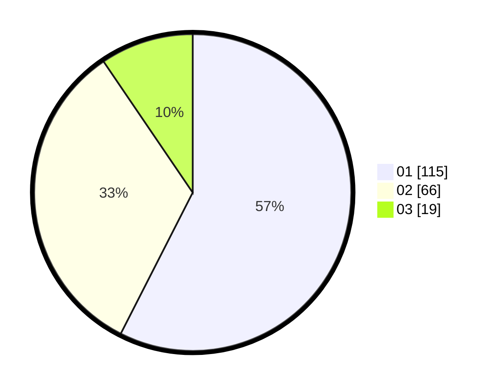

# Hasil

Hasil perolehan suara paslon dapat dilihat pada file paslon-01.txt, paslon-02.txt, dan paslon-03.txt.

Jika tidak ada, artinya data tersebut belum ada pada SIREKAP.

## Perolehan Suara

 * Paslon 01: **115**.
 * Paslon 02: **66**.
 * Paslon 03: **19**.

## Foto C Plano

https://sirekap-obj-formc.kpu.go.id/fb6f/pemilu/ppwp/31/74/04/10/03/3174041003057-20240215-223404--b81857f8-fe0b-4a50-9646-986001ad56bd.jpg

https://sirekap-obj-formc.kpu.go.id/fb6f/pemilu/ppwp/31/74/04/10/03/3174041003057-20240215-223406--fb839c33-5bab-40c4-86f0-73f9a0355b18.jpg

https://sirekap-obj-formc.kpu.go.id/fb6f/pemilu/ppwp/31/74/04/10/03/3174041003057-20240215-223405--90bfea72-b5ff-425c-8536-98d50d89d03b.jpg

## DATA PEMILIH TETAP

Jumlah pemilih dalam DPT: **234**.
 * L: **117**.
 * P: **117**.

## DATA PENGGUNA HAK PILIH

Jumlah pengguna hak pilih dalam DPT: **199**.
 * L: **100**.
 * P: **99**.

Jumlah pengguna hak pilih dalam DPTb: **3**.
 * L: **1**.
 * P: **2**.

Jumlah pengguna hak pilih dalam DPK: **1**.
 * L: **1**.
 * P: **0**.

Jumlah pengguna hak pilih: **203**.
 * L: **102**.
 * P: **101**.

## JUMLAH SUARA SAH DAN TIDAK SAH

JUMLAH SELURUH SUARA SAH: **200**.

JUMLAH SUARA TIDAK SAH: **3**.

JUMLAH SELURUH SUARA SAH DAN SUARA TIDAK SAH: **203**.
