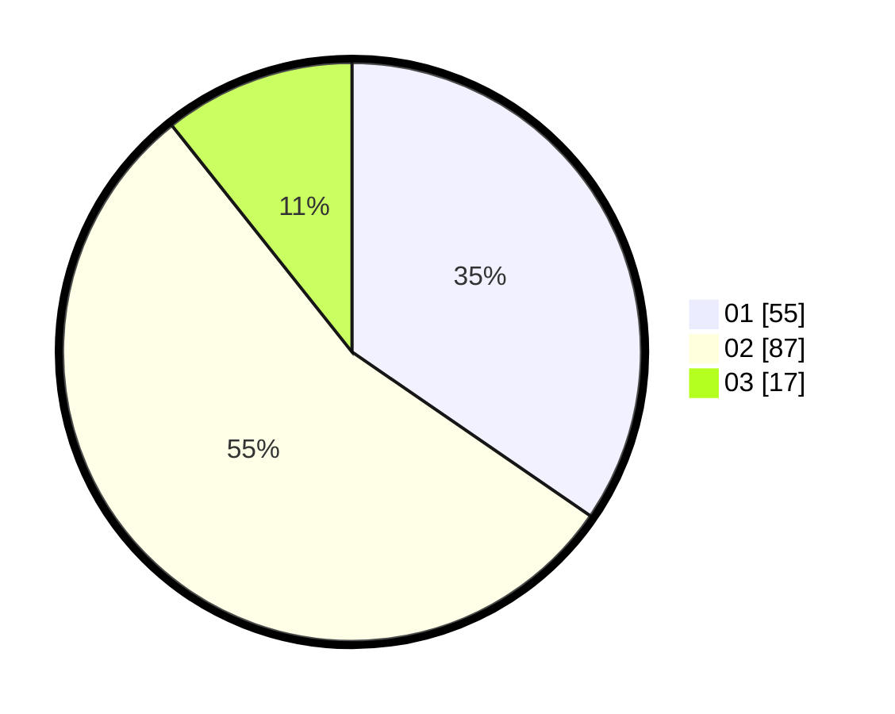

# Hasil

Hasil perolehan suara paslon dapat dilihat pada file paslon-01.txt, paslon-02.txt, dan paslon-03.txt.

Jika tidak ada, artinya data tersebut belum ada pada SIREKAP.

## Perolehan Suara

 * Paslon 01: **55**.
 * Paslon 02: **87**.
 * Paslon 03: **17**.

## Foto C Plano

https://sirekap-obj-formc.kpu.go.id/cd3c/pemilu/ppwp/31/74/04/10/03/3174041003065-20240214-155013--3235ae3b-d958-4d55-bb03-ab8d76a88bcd.jpg

https://sirekap-obj-formc.kpu.go.id/cd3c/pemilu/ppwp/31/74/04/10/03/3174041003065-20240214-155312--b6afb910-a7c4-494f-9618-0b16b9d72702.jpg

https://sirekap-obj-formc.kpu.go.id/cd3c/pemilu/ppwp/31/74/04/10/03/3174041003065-20240214-155550--998fe159-4753-49bb-b3e0-5963bbfc6e5d.jpg

## DATA PEMILIH TETAP

Jumlah pemilih dalam DPT: **212**.
 * L: **84**.
 * P: **128**.

## DATA PENGGUNA HAK PILIH

Jumlah pengguna hak pilih dalam DPT: **149**.
 * L: **49**.
 * P: **100**.

Jumlah pengguna hak pilih dalam DPTb: **3**.
 * L: **1**.
 * P: **2**.

Jumlah pengguna hak pilih dalam DPK: **8**.
 * L: **4**.
 * P: **4**.

Jumlah pengguna hak pilih: **160**.
 * L: **54**.
 * P: **106**.

## JUMLAH SUARA SAH DAN TIDAK SAH

JUMLAH SELURUH SUARA SAH: **159**.

JUMLAH SUARA TIDAK SAH: **1**.

JUMLAH SELURUH SUARA SAH DAN SUARA TIDAK SAH: **160**.
