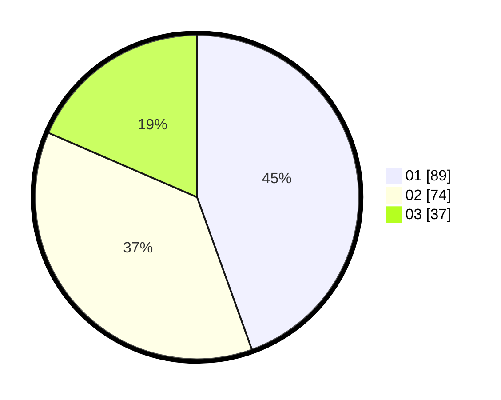

# Hasil

Hasil perolehan suara paslon dapat dilihat pada file paslon-01.txt, paslon-02.txt, dan paslon-03.txt.

Jika tidak ada, artinya data tersebut belum ada pada SIREKAP.

## Perolehan Suara

 * Paslon 01: **89**.
 * Paslon 02: **74**.
 * Paslon 03: **37**.

## Foto C Plano

https://sirekap-obj-formc.kpu.go.id/2d87/pemilu/ppwp/31/74/04/10/04/3174041004001-20240214-214712--691f4a78-086c-472e-934c-9103709bf994.jpg

https://sirekap-obj-formc.kpu.go.id/2d87/pemilu/ppwp/31/74/04/10/04/3174041004001-20240214-215607--923e379b-a1d5-49fb-a2b2-043b1c923f5e.jpg

https://sirekap-obj-formc.kpu.go.id/2d87/pemilu/ppwp/31/74/04/10/04/3174041004001-20240214-215827--58bdd808-9079-4ad7-8022-2c4ed1839c59.jpg
