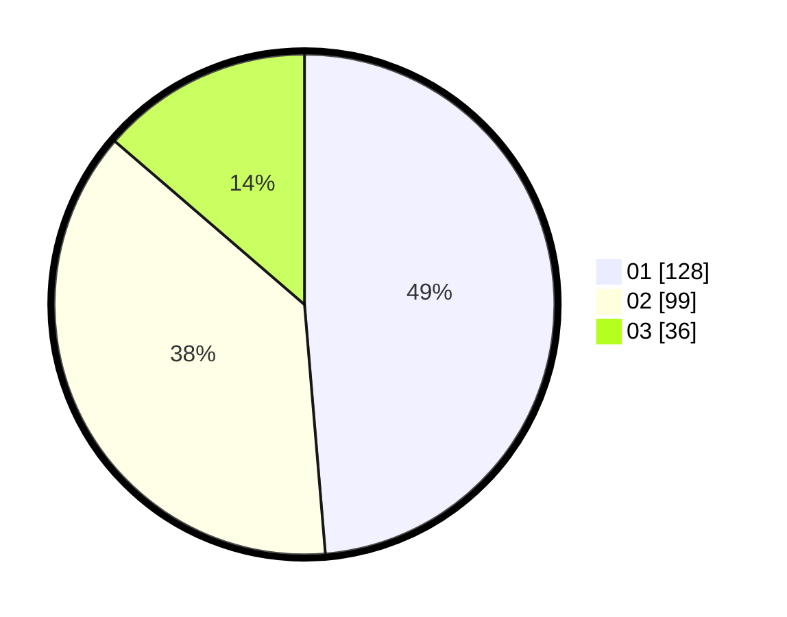

# Hasil

Hasil perolehan suara paslon dapat dilihat pada file paslon-01.txt, paslon-02.txt, dan paslon-03.txt.

Jika tidak ada, artinya data tersebut belum ada pada SIREKAP.

## Perolehan Suara

 * Paslon 01: **128**.
 * Paslon 02: **99**.
 * Paslon 03: **36**.

## Foto C Plano

https://sirekap-obj-formc.kpu.go.id/2db2/pemilu/ppwp/31/74/04/10/04/3174041004006-20240217-133209--9bd12473-a3d0-494a-9d24-783139574f1f.jpg

https://sirekap-obj-formc.kpu.go.id/2db2/pemilu/ppwp/31/74/04/10/04/3174041004006-20240217-134343--e68f8d2e-0bad-4a12-aaa1-9ae4253337ce.jpg

https://sirekap-obj-formc.kpu.go.id/2db2/pemilu/ppwp/31/74/04/10/04/3174041004006-20240217-133817--2e75b7b2-3b8d-40e8-9249-84e7d68bb419.jpg

## DATA PEMILIH TETAP

Jumlah pemilih dalam DPT: **290**.
 * L: **132**.
 * P: **158**.

## DATA PENGGUNA HAK PILIH

Jumlah pengguna hak pilih dalam DPT: **253**.
 * L: **109**.
 * P: **144**.

Jumlah pengguna hak pilih dalam DPTb: **16**.
 * L: **9**.
 * P: **7**.

Jumlah pengguna hak pilih dalam DPK: **0**.
 * L: **0**.
 * P: **0**.

Jumlah pengguna hak pilih: **269**.
 * L: **118**.
 * P: **151**.

## JUMLAH SUARA SAH DAN TIDAK SAH

JUMLAH SELURUH SUARA SAH: **263**.

JUMLAH SUARA TIDAK SAH: **6**.

JUMLAH SELURUH SUARA SAH DAN SUARA TIDAK SAH: **269**.
