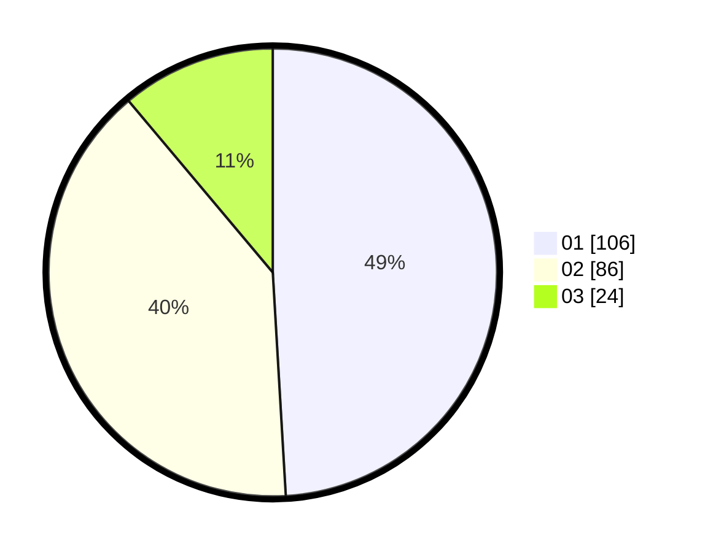

# Hasil

Hasil perolehan suara paslon dapat dilihat pada file paslon-01.txt, paslon-02.txt, dan paslon-03.txt.

Jika tidak ada, artinya data tersebut belum ada pada SIREKAP.

## Perolehan Suara

 * Paslon 01: **106**.
 * Paslon 02: **86**.
 * Paslon 03: **24**.

## Foto C Plano

https://sirekap-obj-formc.kpu.go.id/a9f9/pemilu/ppwp/31/74/04/10/04/3174041004009-20240218-181716--2a9bc38a-d65f-4623-8c2d-1acfdebe3feb.jpg

https://sirekap-obj-formc.kpu.go.id/a9f9/pemilu/ppwp/31/74/04/10/04/3174041004009-20240218-181055--48c67647-1c2c-4c3f-9489-22b0605edb14.jpg

https://sirekap-obj-formc.kpu.go.id/a9f9/pemilu/ppwp/31/74/04/10/04/3174041004009-20240214-223422--6f0cd92d-5e0a-4c9e-ba3e-68edb72d3ed0.jpg

## DATA PEMILIH TETAP

Jumlah pemilih dalam DPT: **253**.
 * L: **122**.
 * P: **131**.

## DATA PENGGUNA HAK PILIH

Jumlah pengguna hak pilih dalam DPT: **210**.
 * L: **99**.
 * P: **111**.

Jumlah pengguna hak pilih dalam DPTb: **3**.
 * L: **2**.
 * P: **1**.

Jumlah pengguna hak pilih dalam DPK: **3**.
 * L: **1**.
 * P: **2**.

Jumlah pengguna hak pilih: **216**.
 * L: **102**.
 * P: **114**.

## JUMLAH SUARA SAH DAN TIDAK SAH

JUMLAH SELURUH SUARA SAH: **216**.

JUMLAH SUARA TIDAK SAH: **0**.

JUMLAH SELURUH SUARA SAH DAN SUARA TIDAK SAH: **216**.
