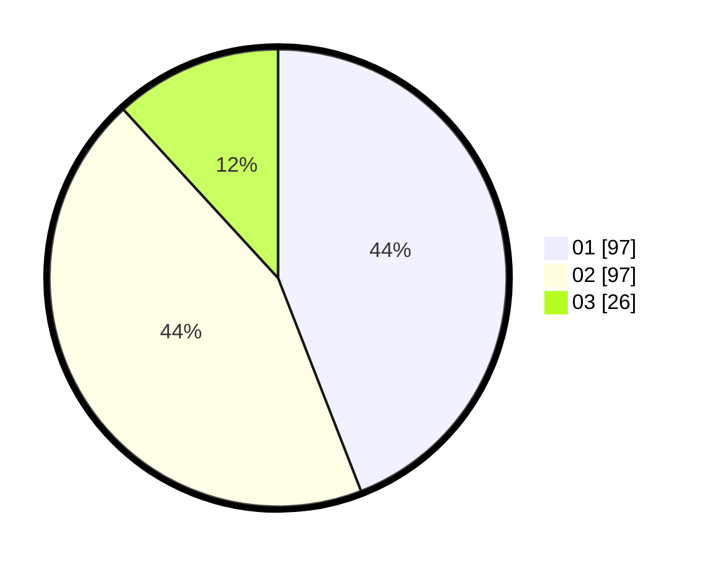

# Hasil

Hasil perolehan suara paslon dapat dilihat pada file paslon-01.txt, paslon-02.txt, dan paslon-03.txt.

Jika tidak ada, artinya data tersebut belum ada pada SIREKAP.

## Perolehan Suara

 * Paslon 01: **97**.
 * Paslon 02: **97**.
 * Paslon 03: **26**.

## Foto C Plano

https://sirekap-obj-formc.kpu.go.id/5efd/pemilu/ppwp/31/74/04/10/04/3174041004022-20240214-201002--73b02649-e7b9-4a68-9c75-d6c29e2112e3.jpg

https://sirekap-obj-formc.kpu.go.id/5efd/pemilu/ppwp/31/74/04/10/04/3174041004022-20240214-201056--f16e1c1e-96d3-4baa-aa57-dcbc10017cbb.jpg

https://sirekap-obj-formc.kpu.go.id/5efd/pemilu/ppwp/31/74/04/10/04/3174041004022-20240214-192726--00a772bf-8df0-47ad-8f16-ddab6c8253d7.jpg

## DATA PEMILIH TETAP

Jumlah pemilih dalam DPT: **257**.
 * L: **128**.
 * P: **129**.

## DATA PENGGUNA HAK PILIH

Jumlah pengguna hak pilih dalam DPT: **207**.
 * L: **102**.
 * P: **105**.

Jumlah pengguna hak pilih dalam DPTb: **12**.
 * L: **3**.
 * P: **9**.

Jumlah pengguna hak pilih dalam DPK: **2**.
 * L: **2**.
 * P: **0**.

Jumlah pengguna hak pilih: **221**.
 * L: **107**.
 * P: **114**.

## JUMLAH SUARA SAH DAN TIDAK SAH

JUMLAH SELURUH SUARA SAH: **220**.

JUMLAH SUARA TIDAK SAH: **1**.

JUMLAH SELURUH SUARA SAH DAN SUARA TIDAK SAH: **221**.
