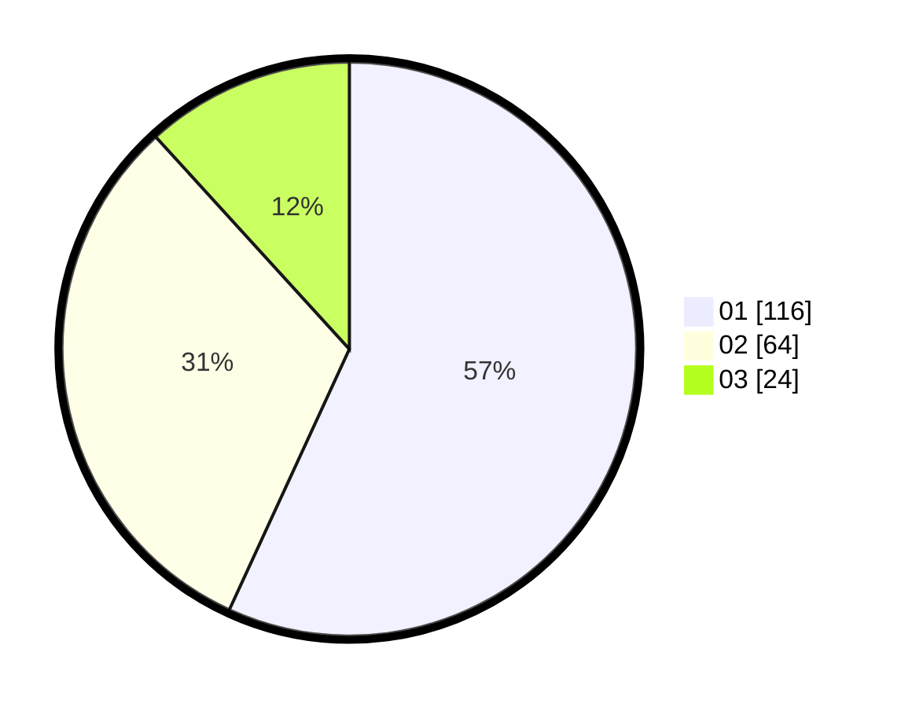

# Hasil

Hasil perolehan suara paslon dapat dilihat pada file paslon-01.txt, paslon-02.txt, dan paslon-03.txt.

Jika tidak ada, artinya data tersebut belum ada pada SIREKAP.

## Perolehan Suara

 * Paslon 01: **116**.
 * Paslon 02: **64**.
 * Paslon 03: **24**.

## Foto C Plano

https://sirekap-obj-formc.kpu.go.id/e56d/pemilu/ppwp/31/74/04/10/04/3174041004023-20240214-155609--fdfb7c3d-7e35-40ec-939e-6330e280b7e8.jpg

https://sirekap-obj-formc.kpu.go.id/e56d/pemilu/ppwp/31/74/04/10/04/3174041004023-20240214-155743--a758f1d1-6ecb-4207-ad4a-8fe3cc309dff.jpg

https://sirekap-obj-formc.kpu.go.id/e56d/pemilu/ppwp/31/74/04/10/04/3174041004023-20240214-160057--cb2453c5-b08d-4c9c-a5b3-ddb83d72e025.jpg

## DATA PEMILIH TETAP

Jumlah pemilih dalam DPT: **256**.
 * L: **126**.
 * P: **130**.

## DATA PENGGUNA HAK PILIH

Jumlah pengguna hak pilih dalam DPT: **205**.
 * L: **96**.
 * P: **109**.

Jumlah pengguna hak pilih dalam DPTb: **2**.
 * L: **0**.
 * P: **2**.

Jumlah pengguna hak pilih dalam DPK: **1**.
 * L: **1**.
 * P: **0**.

Jumlah pengguna hak pilih: **208**.
 * L: **97**.
 * P: **111**.

## JUMLAH SUARA SAH DAN TIDAK SAH

JUMLAH SELURUH SUARA SAH: **204**.

JUMLAH SUARA TIDAK SAH: **4**.

JUMLAH SELURUH SUARA SAH DAN SUARA TIDAK SAH: **208**.
