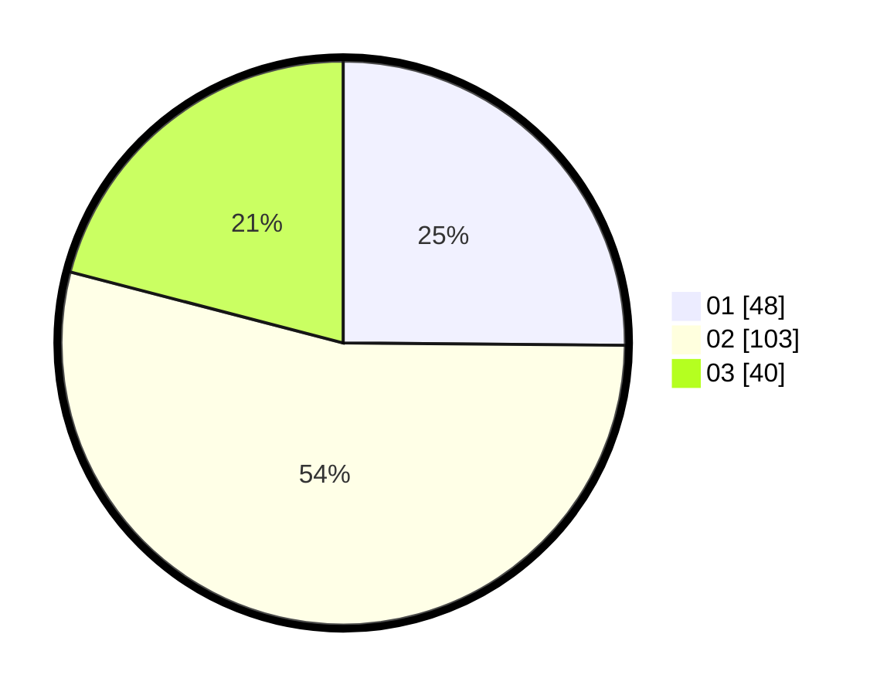

# Hasil

Hasil perolehan suara paslon dapat dilihat pada file paslon-01.txt, paslon-02.txt, dan paslon-03.txt.

Jika tidak ada, artinya data tersebut belum ada pada SIREKAP.

## Perolehan Suara

 * Paslon 01: **48**.
 * Paslon 02: **103**.
 * Paslon 03: **40**.

## Foto C Plano

https://sirekap-obj-formc.kpu.go.id/046a/pemilu/ppwp/31/74/04/10/04/3174041004025-20240214-184502--63ef0e41-ba47-40c5-bd93-6e4697d05239.jpg

https://sirekap-obj-formc.kpu.go.id/046a/pemilu/ppwp/31/74/04/10/04/3174041004025-20240214-214137--e2236bea-1dbd-41ae-9c75-1c949227aa8d.jpg

https://sirekap-obj-formc.kpu.go.id/046a/pemilu/ppwp/31/74/04/10/04/3174041004025-20240214-214054--c6b42d0f-7532-44cd-ad0d-a0fcc3f052c4.jpg
