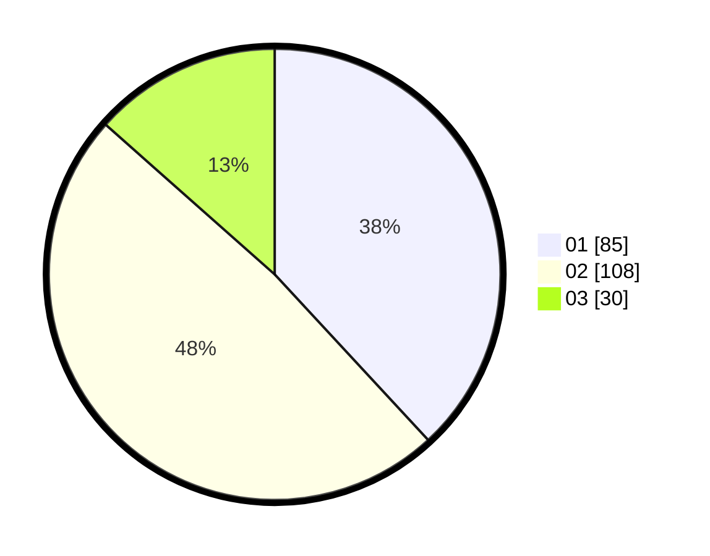

# Hasil

Hasil perolehan suara paslon dapat dilihat pada file paslon-01.txt, paslon-02.txt, dan paslon-03.txt.

Jika tidak ada, artinya data tersebut belum ada pada SIREKAP.

## Perolehan Suara

 * Paslon 01: **85**.
 * Paslon 02: **108**.
 * Paslon 03: **30**.

## Foto C Plano

https://sirekap-obj-formc.kpu.go.id/a7e7/pemilu/ppwp/31/74/04/10/04/3174041004029-20240214-191050--9b82caf9-a9aa-48de-92fc-ae7815b4a17d.jpg

https://sirekap-obj-formc.kpu.go.id/a7e7/pemilu/ppwp/31/74/04/10/04/3174041004029-20240214-191111--38903ecf-1684-4c80-bc27-73dc967cc3cc.jpg

https://sirekap-obj-formc.kpu.go.id/a7e7/pemilu/ppwp/31/74/04/10/04/3174041004029-20240216-121204--74b52853-4d88-4755-a33b-e03893596962.jpg

## DATA PEMILIH TETAP

Jumlah pemilih dalam DPT: **270**.
 * L: **136**.
 * P: **134**.

## DATA PENGGUNA HAK PILIH

Jumlah pengguna hak pilih dalam DPT: **222**.
 * L: **111**.
 * P: **111**.

Jumlah pengguna hak pilih dalam DPTb: **1**.
 * L: **0**.
 * P: **1**.

Jumlah pengguna hak pilih dalam DPK: **2**.
 * L: **0**.
 * P: **2**.

Jumlah pengguna hak pilih: **225**.
 * L: **111**.
 * P: **114**.

## JUMLAH SUARA SAH DAN TIDAK SAH

JUMLAH SELURUH SUARA SAH: **223**.

JUMLAH SUARA TIDAK SAH: **2**.

JUMLAH SELURUH SUARA SAH DAN SUARA TIDAK SAH: **225**.
