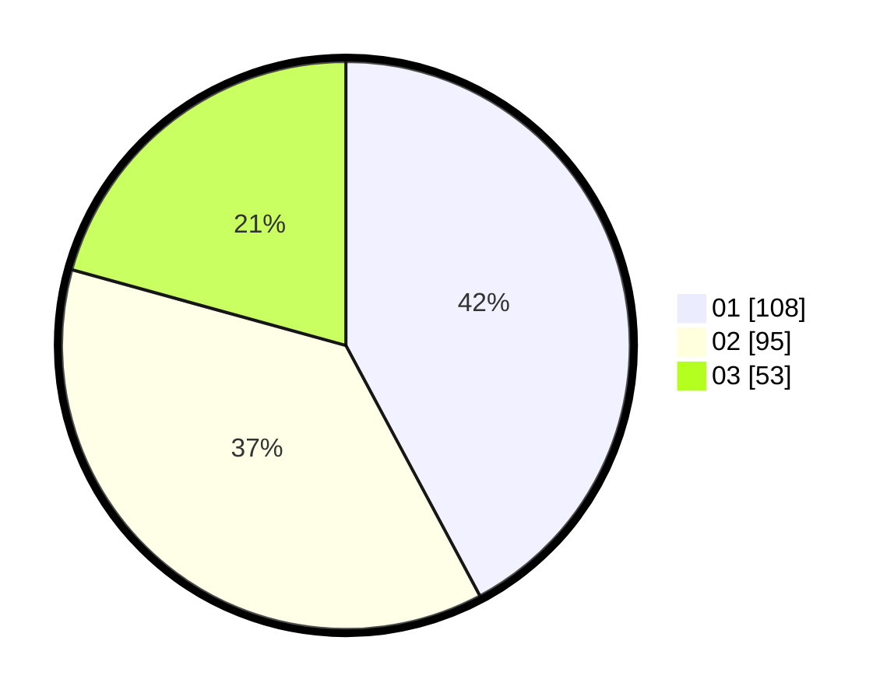

# Hasil

Hasil perolehan suara paslon dapat dilihat pada file paslon-01.txt, paslon-02.txt, dan paslon-03.txt.

Jika tidak ada, artinya data tersebut belum ada pada SIREKAP.

## Perolehan Suara

 * Paslon 01: **108**.
 * Paslon 02: **95**.
 * Paslon 03: **53**.

## Foto C Plano

https://sirekap-obj-formc.kpu.go.id/df9d/pemilu/ppwp/31/74/04/10/04/3174041004042-20240216-211804--4442bb3c-9d11-4f4a-96fd-eb7d02fce423.jpg

https://sirekap-obj-formc.kpu.go.id/df9d/pemilu/ppwp/31/74/04/10/04/3174041004042-20240215-013214--9483c6ac-ccac-451c-8475-cf1509f48acf.jpg

https://sirekap-obj-formc.kpu.go.id/df9d/pemilu/ppwp/31/74/04/10/04/3174041004042-20240215-013252--ad28880f-b7e5-4c9b-8c48-a9218be8efe3.jpg

## DATA PEMILIH TETAP

Jumlah pemilih dalam DPT: **298**.
 * L: **153**.
 * P: **145**.

## DATA PENGGUNA HAK PILIH

Jumlah pengguna hak pilih dalam DPT: **242**.
 * L: **123**.
 * P: **119**.

Jumlah pengguna hak pilih dalam DPTb: **17**.
 * L: **7**.
 * P: **10**.

Jumlah pengguna hak pilih dalam DPK: **0**.
 * L: **0**.
 * P: **0**.

Jumlah pengguna hak pilih: **259**.
 * L: **130**.
 * P: **129**.

## JUMLAH SUARA SAH DAN TIDAK SAH

JUMLAH SELURUH SUARA SAH: **256**.

JUMLAH SUARA TIDAK SAH: **3**.

JUMLAH SELURUH SUARA SAH DAN SUARA TIDAK SAH: **259**.
