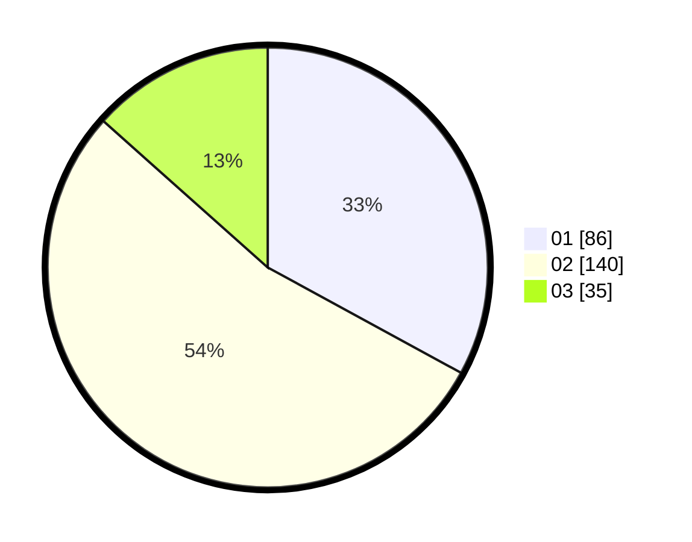

# Hasil

Hasil perolehan suara paslon dapat dilihat pada file paslon-01.txt, paslon-02.txt, dan paslon-03.txt.

Jika tidak ada, artinya data tersebut belum ada pada SIREKAP.

## Perolehan Suara

 * Paslon 01: **86**.
 * Paslon 02: **140**.
 * Paslon 03: **35**.

## Foto C Plano

https://sirekap-obj-formc.kpu.go.id/dcd9/pemilu/ppwp/31/74/04/10/04/3174041004043-20240214-193153--6b763aa2-1761-41a3-b471-9f64d5575155.jpg

https://sirekap-obj-formc.kpu.go.id/dcd9/pemilu/ppwp/31/74/04/10/04/3174041004043-20240214-193150--91aeed52-5c87-4354-8264-9629736f72ad.jpg

https://sirekap-obj-formc.kpu.go.id/dcd9/pemilu/ppwp/31/74/04/10/04/3174041004043-20240216-175937--233fbde3-54ce-4fe3-b459-8b5eb3b2baf0.jpg

## DATA PEMILIH TETAP

Jumlah pemilih dalam DPT: **300**.
 * L: **152**.
 * P: **148**.

## DATA PENGGUNA HAK PILIH

Jumlah pengguna hak pilih dalam DPT: **252**.
 * L: **122**.
 * P: **130**.

Jumlah pengguna hak pilih dalam DPTb: **10**.
 * L: **4**.
 * P: **6**.

Jumlah pengguna hak pilih dalam DPK: **3**.
 * L: **2**.
 * P: **1**.

Jumlah pengguna hak pilih: **265**.
 * L: **128**.
 * P: **137**.

## JUMLAH SUARA SAH DAN TIDAK SAH

JUMLAH SELURUH SUARA SAH: **261**.

JUMLAH SUARA TIDAK SAH: **4**.

JUMLAH SELURUH SUARA SAH DAN SUARA TIDAK SAH: **265**.
