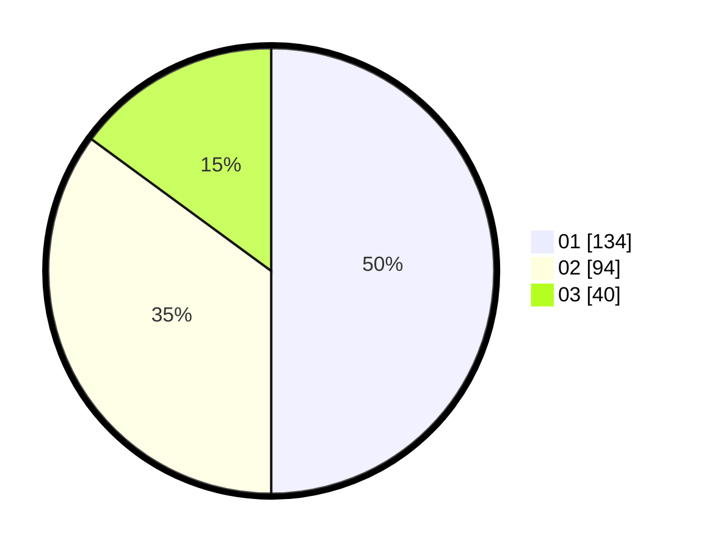

# Hasil

Hasil perolehan suara paslon dapat dilihat pada file paslon-01.txt, paslon-02.txt, dan paslon-03.txt.

Jika tidak ada, artinya data tersebut belum ada pada SIREKAP.

## Perolehan Suara

 * Paslon 01: **134**.
 * Paslon 02: **94**.
 * Paslon 03: **40**.

## Foto C Plano

https://sirekap-obj-formc.kpu.go.id/060e/pemilu/ppwp/31/74/04/10/04/3174041004045-20240214-155509--312f1476-e166-49b3-81b3-6376f360eae1.jpg

https://sirekap-obj-formc.kpu.go.id/060e/pemilu/ppwp/31/74/04/10/04/3174041004045-20240214-155647--d00da170-1f48-4b52-a518-b6b6de9c0f25.jpg

https://sirekap-obj-formc.kpu.go.id/060e/pemilu/ppwp/31/74/04/10/04/3174041004045-20240214-155824--713a5cb3-bfab-4079-9a58-d809fa4dbfbe.jpg

## DATA PEMILIH TETAP

Jumlah pemilih dalam DPT: **298**.
 * L: **146**.
 * P: **152**.

## DATA PENGGUNA HAK PILIH

Jumlah pengguna hak pilih dalam DPT: **252**.
 * L: **124**.
 * P: **128**.

Jumlah pengguna hak pilih dalam DPTb: **15**.
 * L: **6**.
 * P: **9**.

Jumlah pengguna hak pilih dalam DPK: **6**.
 * L: **2**.
 * P: **4**.

Jumlah pengguna hak pilih: **273**.
 * L: **132**.
 * P: **141**.

## JUMLAH SUARA SAH DAN TIDAK SAH

JUMLAH SELURUH SUARA SAH: **268**.

JUMLAH SUARA TIDAK SAH: **5**.

JUMLAH SELURUH SUARA SAH DAN SUARA TIDAK SAH: **273**.
