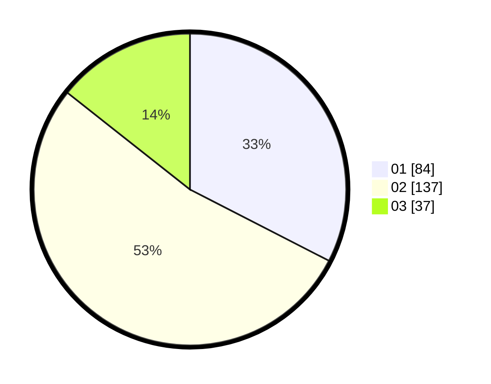

# Hasil

Hasil perolehan suara paslon dapat dilihat pada file paslon-01.txt, paslon-02.txt, dan paslon-03.txt.

Jika tidak ada, artinya data tersebut belum ada pada SIREKAP.

## Perolehan Suara

 * Paslon 01: **84**.
 * Paslon 02: **137**.
 * Paslon 03: **37**.

## Foto C Plano

https://sirekap-obj-formc.kpu.go.id/4bb1/pemilu/ppwp/31/74/04/10/04/3174041004058-20240214-190827--b8f22ddb-f97b-4fa4-9d8c-6ac940edf970.jpg

https://sirekap-obj-formc.kpu.go.id/4bb1/pemilu/ppwp/31/74/04/10/04/3174041004058-20240214-191117--6e9a992c-ba1d-4756-97e2-46862370c879.jpg

https://sirekap-obj-formc.kpu.go.id/4bb1/pemilu/ppwp/31/74/04/10/04/3174041004058-20240214-190439--ce2e6611-7c82-4f4b-b72f-ad768fb22656.jpg

## DATA PEMILIH TETAP

Jumlah pemilih dalam DPT: **293**.
 * L: **137**.
 * P: **156**.

## DATA PENGGUNA HAK PILIH

Jumlah pengguna hak pilih dalam DPT: **243**.
 * L: **114**.
 * P: **129**.

Jumlah pengguna hak pilih dalam DPTb: **11**.
 * L: **3**.
 * P: **8**.

Jumlah pengguna hak pilih dalam DPK: **5**.
 * L: **2**.
 * P: **3**.

Jumlah pengguna hak pilih: **259**.
 * L: **119**.
 * P: **140**.

## JUMLAH SUARA SAH DAN TIDAK SAH

JUMLAH SELURUH SUARA SAH: **258**.

JUMLAH SUARA TIDAK SAH: **1**.

JUMLAH SELURUH SUARA SAH DAN SUARA TIDAK SAH: **259**.
