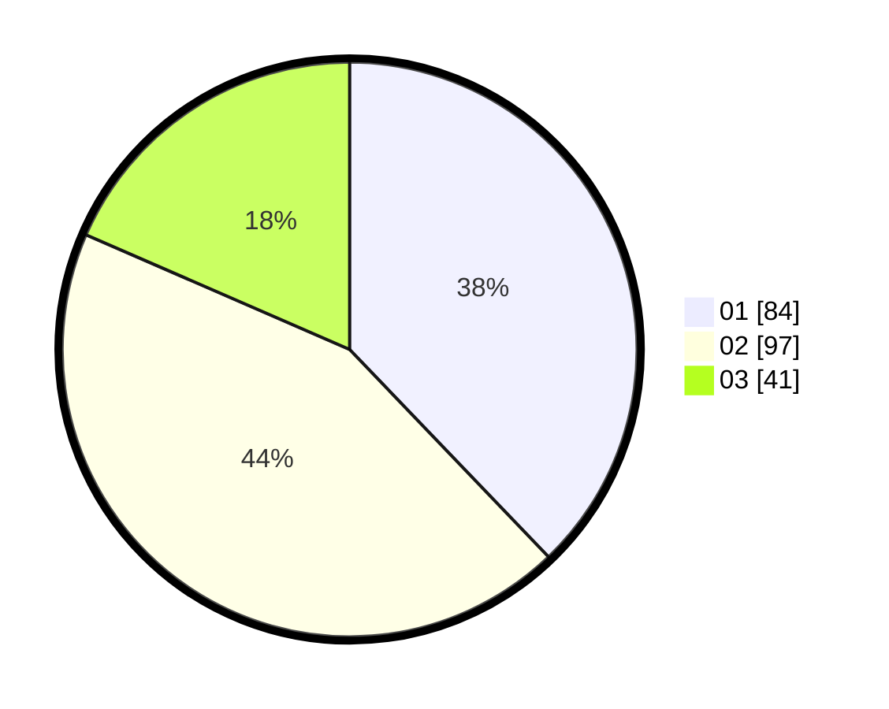

# Hasil

Hasil perolehan suara paslon dapat dilihat pada file paslon-01.txt, paslon-02.txt, dan paslon-03.txt.

Jika tidak ada, artinya data tersebut belum ada pada SIREKAP.

## Perolehan Suara

 * Paslon 01: **84**.
 * Paslon 02: **97**.
 * Paslon 03: **41**.

## Foto C Plano

https://sirekap-obj-formc.kpu.go.id/6444/pemilu/ppwp/31/74/04/10/04/3174041004070-20240214-194155--1789e416-ddd4-4b6d-b799-17f4bd71f3db.jpg

https://sirekap-obj-formc.kpu.go.id/6444/pemilu/ppwp/31/74/04/10/04/3174041004070-20240214-204041--3bf8fb2b-348f-4e92-9d3f-c3aa7a041ce4.jpg

https://sirekap-obj-formc.kpu.go.id/6444/pemilu/ppwp/31/74/04/10/04/3174041004070-20240214-214912--26661f88-1e84-4936-a393-1a67cbf20b9c.jpg

## DATA PEMILIH TETAP

Jumlah pemilih dalam DPT: **269**.
 * L: **124**.
 * P: **145**.

## DATA PENGGUNA HAK PILIH

Jumlah pengguna hak pilih dalam DPT: **220**.
 * L: **102**.
 * P: **118**.

Jumlah pengguna hak pilih dalam DPTb: **3**.
 * L: **1**.
 * P: **2**.

Jumlah pengguna hak pilih dalam DPK: **3**.
 * L: **2**.
 * P: **1**.

Jumlah pengguna hak pilih: **226**.
 * L: **105**.
 * P: **121**.

## JUMLAH SUARA SAH DAN TIDAK SAH

JUMLAH SELURUH SUARA SAH: **222**.

JUMLAH SUARA TIDAK SAH: **4**.

JUMLAH SELURUH SUARA SAH DAN SUARA TIDAK SAH: **226**.
