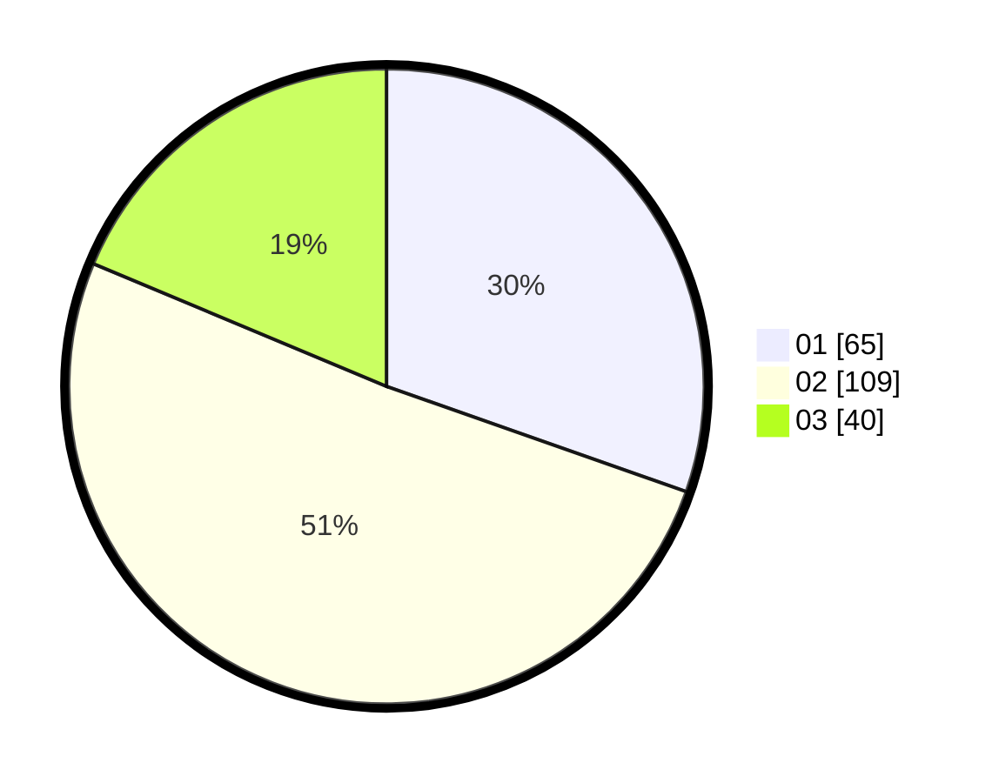

# Hasil

Hasil perolehan suara paslon dapat dilihat pada file paslon-01.txt, paslon-02.txt, dan paslon-03.txt.

Jika tidak ada, artinya data tersebut belum ada pada SIREKAP.

## Perolehan Suara

 * Paslon 01: **65**.
 * Paslon 02: **109**.
 * Paslon 03: **40**.

## Foto C Plano

https://sirekap-obj-formc.kpu.go.id/aece/pemilu/ppwp/31/74/04/10/04/3174041004072-20240215-003307--647e0050-60d2-4dd6-b12a-5088a17353f7.jpg

https://sirekap-obj-formc.kpu.go.id/aece/pemilu/ppwp/31/74/04/10/04/3174041004072-20240215-003418--61f22e8a-f533-46e8-8733-d78277aa3de2.jpg

https://sirekap-obj-formc.kpu.go.id/aece/pemilu/ppwp/31/74/04/10/04/3174041004072-20240215-003559--945ed7bc-9ca7-4415-8dac-9eaa17f16f5d.jpg

## DATA PEMILIH TETAP

Jumlah pemilih dalam DPT: **215**.
 * L: **106**.
 * P: **109**.

## DATA PENGGUNA HAK PILIH

Jumlah pengguna hak pilih dalam DPT: **215**.
 * L: **106**.
 * P: **109**.

Jumlah pengguna hak pilih dalam DPTb: **0**.
 * L: **0**.
 * P: **0**.

Jumlah pengguna hak pilih dalam DPK: **0**.
 * L: **0**.
 * P: **0**.

Jumlah pengguna hak pilih: **215**.
 * L: **106**.
 * P: **109**.

## JUMLAH SUARA SAH DAN TIDAK SAH

JUMLAH SELURUH SUARA SAH: **214**.

JUMLAH SUARA TIDAK SAH: **1**.

JUMLAH SELURUH SUARA SAH DAN SUARA TIDAK SAH: **215**.
