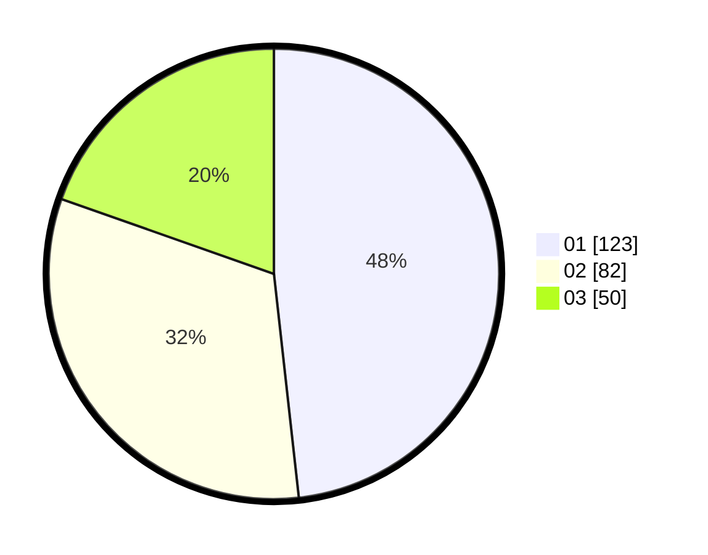

# Hasil

Hasil perolehan suara paslon dapat dilihat pada file paslon-01.txt, paslon-02.txt, dan paslon-03.txt.

Jika tidak ada, artinya data tersebut belum ada pada SIREKAP.

## Perolehan Suara

 * Paslon 01: **123**.
 * Paslon 02: **82**.
 * Paslon 03: **50**.

## Foto C Plano

https://sirekap-obj-formc.kpu.go.id/e504/pemilu/ppwp/31/74/04/10/04/3174041004081-20240215-004758--f64ae43e-b23b-4486-8269-862309db3536.jpg

https://sirekap-obj-formc.kpu.go.id/e504/pemilu/ppwp/31/74/04/10/04/3174041004081-20240215-030148--c6594d5d-c50f-49f2-833d-1ed8e1b2abde.jpg

https://sirekap-obj-formc.kpu.go.id/e504/pemilu/ppwp/31/74/04/10/04/3174041004081-20240215-005200--99d0707c-96ac-4770-80c8-953710f01f9d.jpg

## DATA PEMILIH TETAP

Jumlah pemilih dalam DPT: **275**.
 * L: **140**.
 * P: **135**.

## DATA PENGGUNA HAK PILIH

Jumlah pengguna hak pilih dalam DPT: **230**.
 * L: **112**.
 * P: **118**.

Jumlah pengguna hak pilih dalam DPTb: **25**.
 * L: **10**.
 * P: **15**.

Jumlah pengguna hak pilih dalam DPK: **1**.
 * L: **1**.
 * P: **0**.

Jumlah pengguna hak pilih: **256**.
 * L: **123**.
 * P: **133**.

## JUMLAH SUARA SAH DAN TIDAK SAH

JUMLAH SELURUH SUARA SAH: **255**.

JUMLAH SUARA TIDAK SAH: **1**.

JUMLAH SELURUH SUARA SAH DAN SUARA TIDAK SAH: **256**.
