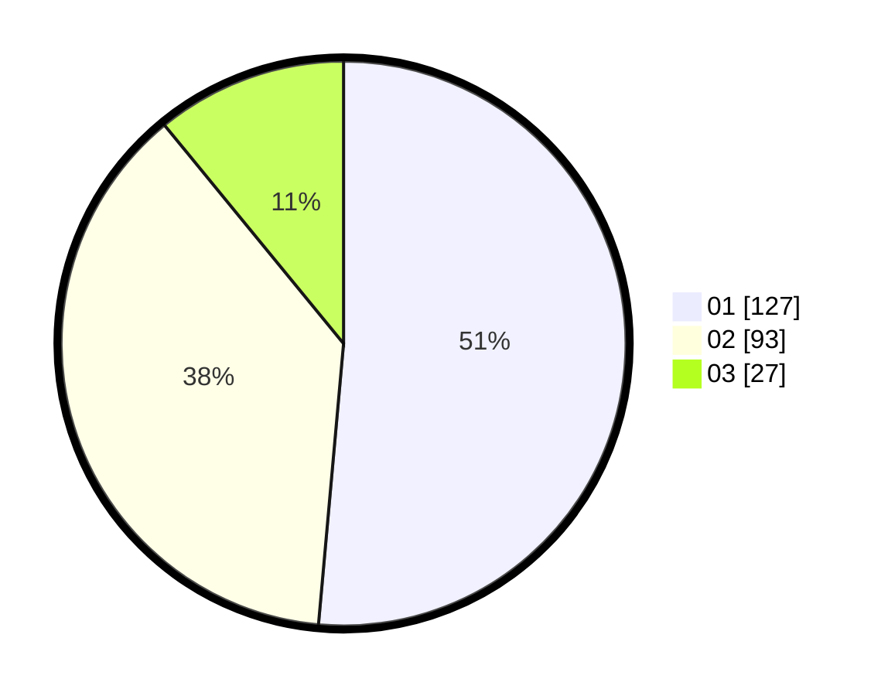

# Hasil

Hasil perolehan suara paslon dapat dilihat pada file paslon-01.txt, paslon-02.txt, dan paslon-03.txt.

Jika tidak ada, artinya data tersebut belum ada pada SIREKAP.

## Perolehan Suara

 * Paslon 01: **127**.
 * Paslon 02: **93**.
 * Paslon 03: **27**.

## Foto C Plano

https://sirekap-obj-formc.kpu.go.id/b2fd/pemilu/ppwp/31/74/04/10/04/3174041004082-20240217-192743--f636fde0-c686-4454-8fae-8ad62daf8b86.jpg

https://sirekap-obj-formc.kpu.go.id/b2fd/pemilu/ppwp/31/74/04/10/04/3174041004082-20240217-194122--8683aebc-d859-46ad-8f7a-69a23d45f0c2.jpg

https://sirekap-obj-formc.kpu.go.id/b2fd/pemilu/ppwp/31/74/04/10/04/3174041004082-20240217-194315--8e1c64e5-58cd-4b10-b745-ca1836d342b9.jpg

## DATA PEMILIH TETAP

Jumlah pemilih dalam DPT: **273**.
 * L: **134**.
 * P: **139**.

## DATA PENGGUNA HAK PILIH

Jumlah pengguna hak pilih dalam DPT: **238**.
 * L: **116**.
 * P: **122**.

Jumlah pengguna hak pilih dalam DPTb: **16**.
 * L: **7**.
 * P: **9**.

Jumlah pengguna hak pilih dalam DPK: **0**.
 * L: **0**.
 * P: **0**.

Jumlah pengguna hak pilih: **254**.
 * L: **123**.
 * P: **131**.

## JUMLAH SUARA SAH DAN TIDAK SAH

JUMLAH SELURUH SUARA SAH: **247**.

JUMLAH SUARA TIDAK SAH: **7**.

JUMLAH SELURUH SUARA SAH DAN SUARA TIDAK SAH: **254**.
