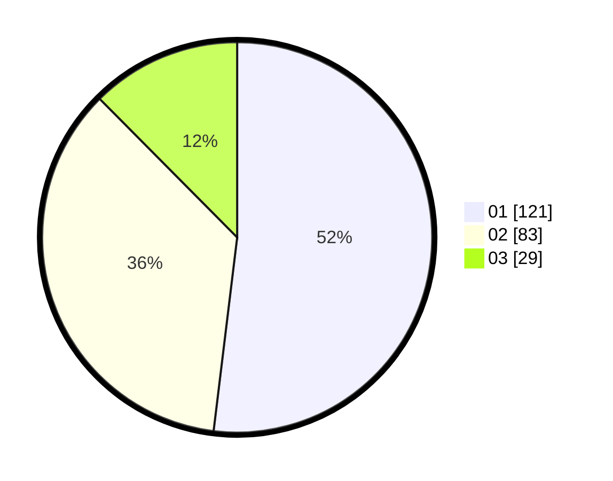

# Hasil

Hasil perolehan suara paslon dapat dilihat pada file paslon-01.txt, paslon-02.txt, dan paslon-03.txt.

Jika tidak ada, artinya data tersebut belum ada pada SIREKAP.

## Perolehan Suara

 * Paslon 01: **121**.
 * Paslon 02: **83**.
 * Paslon 03: **29**.

## Foto C Plano

https://sirekap-obj-formc.kpu.go.id/63b0/pemilu/ppwp/31/74/04/10/04/3174041004083-20240217-192018--3989596d-acb4-464b-835e-2bfbebfc5e13.jpg

https://sirekap-obj-formc.kpu.go.id/63b0/pemilu/ppwp/31/74/04/10/04/3174041004083-20240217-192204--8bdf367a-a53b-4361-9627-640a52631000.jpg

https://sirekap-obj-formc.kpu.go.id/63b0/pemilu/ppwp/31/74/04/10/04/3174041004083-20240217-192302--2c465e0f-c37e-456b-bd0d-49aad79034ec.jpg

## DATA PEMILIH TETAP

Jumlah pemilih dalam DPT: **281**.
 * L: **145**.
 * P: **136**.

## DATA PENGGUNA HAK PILIH

Jumlah pengguna hak pilih dalam DPT: **219**.
 * L: **113**.
 * P: **108**.

Jumlah pengguna hak pilih dalam DPTb: **16**.
 * L: **8**.
 * P: **8**.

Jumlah pengguna hak pilih dalam DPK: **0**.
 * L: **0**.
 * P: **0**.

Jumlah pengguna hak pilih: **235**.
 * L: **121**.
 * P: **114**.

## JUMLAH SUARA SAH DAN TIDAK SAH

JUMLAH SELURUH SUARA SAH: **233**.

JUMLAH SUARA TIDAK SAH: **2**.

JUMLAH SELURUH SUARA SAH DAN SUARA TIDAK SAH: **235**.
