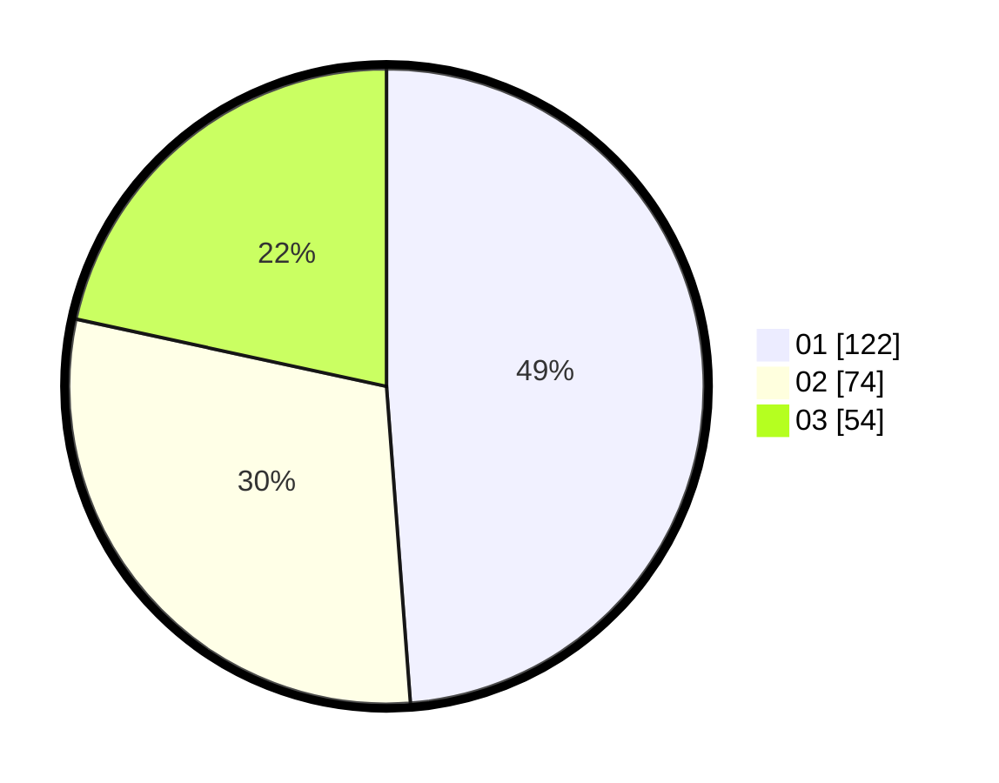

# Hasil

Hasil perolehan suara paslon dapat dilihat pada file paslon-01.txt, paslon-02.txt, dan paslon-03.txt.

Jika tidak ada, artinya data tersebut belum ada pada SIREKAP.

## Perolehan Suara

 * Paslon 01: **122**.
 * Paslon 02: **74**.
 * Paslon 03: **54**.

## Foto C Plano

https://sirekap-obj-formc.kpu.go.id/019e/pemilu/ppwp/31/74/04/10/04/3174041004084-20240214-191349--ff21f6b2-9973-4973-b94b-86a6c03f5692.jpg

https://sirekap-obj-formc.kpu.go.id/019e/pemilu/ppwp/31/74/04/10/04/3174041004084-20240214-191537--f46c74f7-2bef-49b6-93e2-0df91f8690d9.jpg

https://sirekap-obj-formc.kpu.go.id/019e/pemilu/ppwp/31/74/04/10/04/3174041004084-20240214-191818--d8e1b456-7822-4987-86fa-f22f3482d35c.jpg

## DATA PEMILIH TETAP

Jumlah pemilih dalam DPT: **274**.
 * L: **124**.
 * P: **150**.

## DATA PENGGUNA HAK PILIH

Jumlah pengguna hak pilih dalam DPT: **243**.
 * L: **109**.
 * P: **134**.

Jumlah pengguna hak pilih dalam DPTb: **12**.
 * L: **8**.
 * P: **4**.

Jumlah pengguna hak pilih dalam DPK: **5**.
 * L: **2**.
 * P: **3**.

Jumlah pengguna hak pilih: **260**.
 * L: **119**.
 * P: **141**.

## JUMLAH SUARA SAH DAN TIDAK SAH

JUMLAH SELURUH SUARA SAH: **255**.

JUMLAH SUARA TIDAK SAH: **6**.

JUMLAH SELURUH SUARA SAH DAN SUARA TIDAK SAH: **261**.
