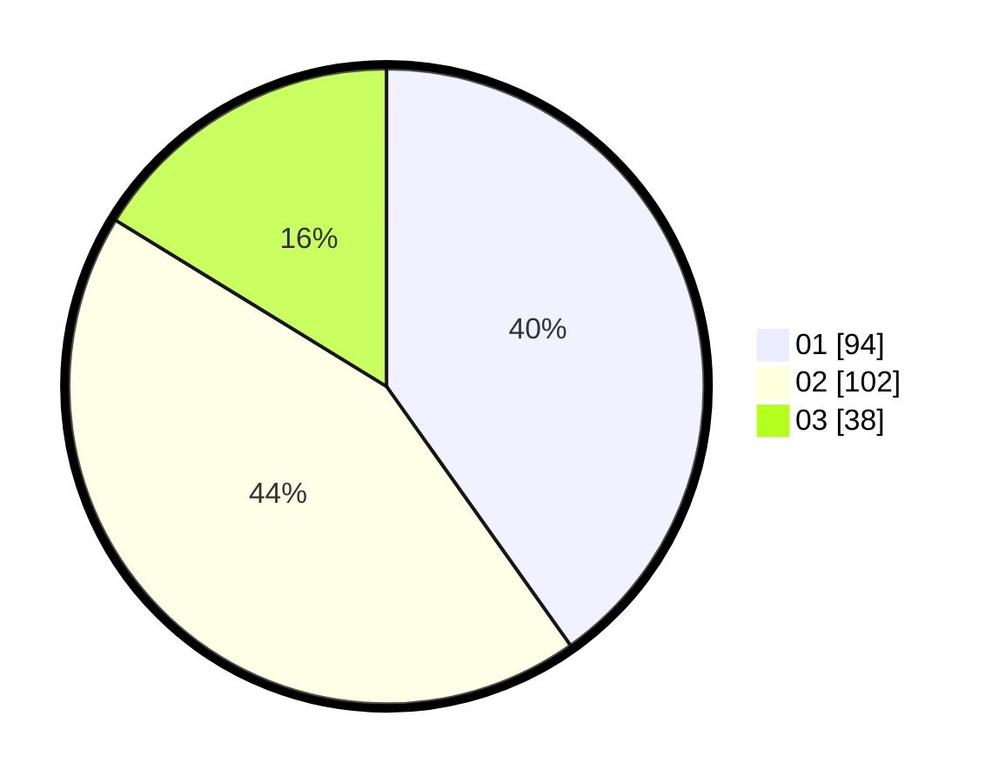

# Hasil

Hasil perolehan suara paslon dapat dilihat pada file paslon-01.txt, paslon-02.txt, dan paslon-03.txt.

Jika tidak ada, artinya data tersebut belum ada pada SIREKAP.

## Perolehan Suara

 * Paslon 01: **94**.
 * Paslon 02: **102**.
 * Paslon 03: **38**.

## Foto C Plano

https://sirekap-obj-formc.kpu.go.id/7cc3/pemilu/ppwp/31/74/04/10/04/3174041004086-20240214-193602--129f88e0-c13a-4988-a301-6422f2f96b6e.jpg

https://sirekap-obj-formc.kpu.go.id/7cc3/pemilu/ppwp/31/74/04/10/04/3174041004086-20240214-193706--52b746f1-899d-401d-b119-b4dc97ee739e.jpg

https://sirekap-obj-formc.kpu.go.id/7cc3/pemilu/ppwp/31/74/04/10/04/3174041004086-20240214-193818--558baf79-1c96-4c10-b6ef-4e77e70aae27.jpg

## DATA PEMILIH TETAP

Jumlah pemilih dalam DPT: **274**.
 * L: **138**.
 * P: **136**.

## DATA PENGGUNA HAK PILIH

Jumlah pengguna hak pilih dalam DPT: **223**.
 * L: **109**.
 * P: **114**.

Jumlah pengguna hak pilih dalam DPTb: **7**.
 * L: **3**.
 * P: **4**.

Jumlah pengguna hak pilih dalam DPK: **5**.
 * L: **2**.
 * P: **3**.

Jumlah pengguna hak pilih: **235**.
 * L: **114**.
 * P: **121**.

## JUMLAH SUARA SAH DAN TIDAK SAH

JUMLAH SELURUH SUARA SAH: **234**.

JUMLAH SUARA TIDAK SAH: **1**.

JUMLAH SELURUH SUARA SAH DAN SUARA TIDAK SAH: **235**.
