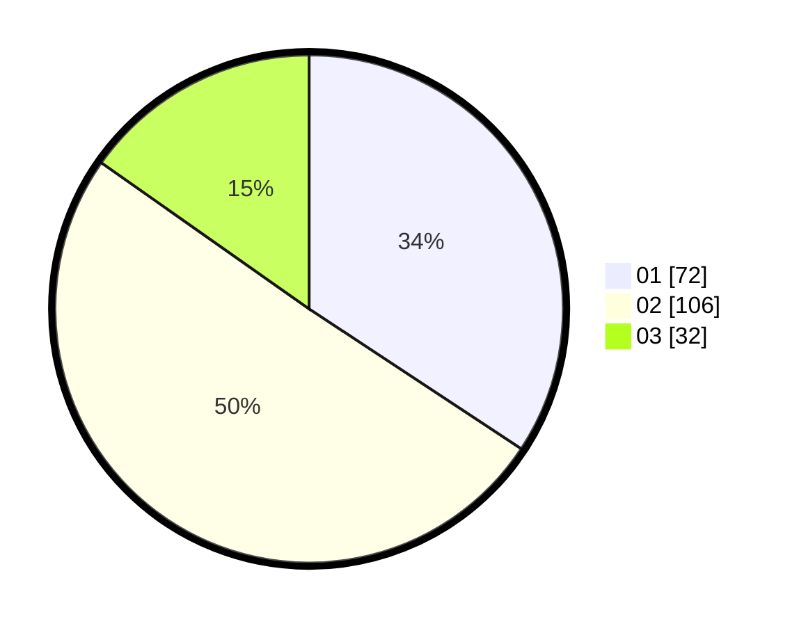

# Hasil

Hasil perolehan suara paslon dapat dilihat pada file paslon-01.txt, paslon-02.txt, dan paslon-03.txt.

Jika tidak ada, artinya data tersebut belum ada pada SIREKAP.

## Perolehan Suara

 * Paslon 01: **72**.
 * Paslon 02: **106**.
 * Paslon 03: **32**.

## Foto C Plano

https://sirekap-obj-formc.kpu.go.id/9e32/pemilu/ppwp/31/74/04/10/04/3174041004092-20240214-201519--c3dda7e0-9e23-47ea-98da-ce483e7e2448.jpg

https://sirekap-obj-formc.kpu.go.id/9e32/pemilu/ppwp/31/74/04/10/04/3174041004092-20240214-203125--bbd2c3b8-149b-4690-a821-72c853f397a5.jpg

https://sirekap-obj-formc.kpu.go.id/9e32/pemilu/ppwp/31/74/04/10/04/3174041004092-20240214-213712--3cff6e72-028e-4ac1-a146-b1e730960d69.jpg

## DATA PEMILIH TETAP

Jumlah pemilih dalam DPT: **279**.
 * L: **145**.
 * P: **134**.

## DATA PENGGUNA HAK PILIH

Jumlah pengguna hak pilih dalam DPT: **209**.
 * L: **108**.
 * P: **101**.

Jumlah pengguna hak pilih dalam DPTb: **2**.
 * L: **1**.
 * P: **1**.

Jumlah pengguna hak pilih dalam DPK: **1**.
 * L: **1**.
 * P: **0**.

Jumlah pengguna hak pilih: **212**.
 * L: **110**.
 * P: **102**.

## JUMLAH SUARA SAH DAN TIDAK SAH

JUMLAH SELURUH SUARA SAH: **210**.

JUMLAH SUARA TIDAK SAH: **2**.

JUMLAH SELURUH SUARA SAH DAN SUARA TIDAK SAH: **212**.
