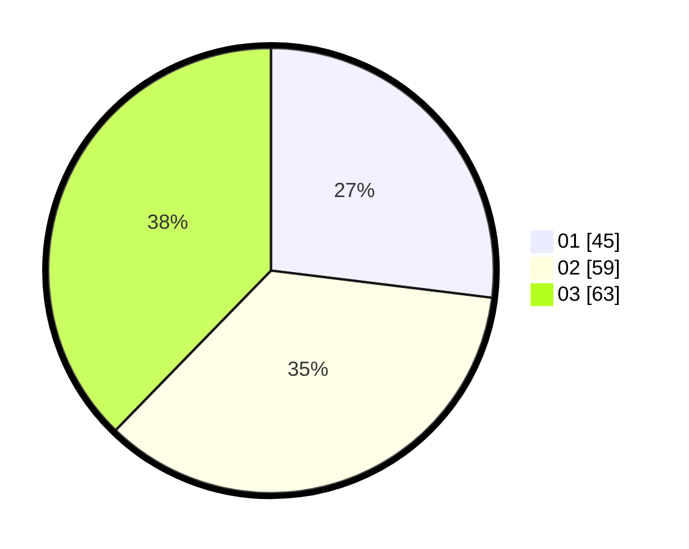

# Hasil

Hasil perolehan suara paslon dapat dilihat pada file paslon-01.txt, paslon-02.txt, dan paslon-03.txt.

Jika tidak ada, artinya data tersebut belum ada pada SIREKAP.

## Perolehan Suara

 * Paslon 01: **45**.
 * Paslon 02: **59**.
 * Paslon 03: **63**.

## Foto C Plano

https://sirekap-obj-formc.kpu.go.id/efc6/pemilu/ppwp/31/74/04/10/04/3174041004093-20240215-205929--e30a32c3-d8a2-489b-96a3-00c6201f4b2f.jpg

https://sirekap-obj-formc.kpu.go.id/efc6/pemilu/ppwp/31/74/04/10/04/3174041004093-20240215-205018--4b48aab4-237c-406a-933f-870c9b5b7e58.jpg

https://sirekap-obj-formc.kpu.go.id/efc6/pemilu/ppwp/31/74/04/10/04/3174041004093-20240215-205356--73b22974-e868-49c9-a4fd-3879cdb6dde4.jpg

## DATA PEMILIH TETAP

Jumlah pemilih dalam DPT: **219**.
 * L: **108**.
 * P: **111**.

## DATA PENGGUNA HAK PILIH

Jumlah pengguna hak pilih dalam DPT: **158**.
 * L: **74**.
 * P: **84**.

Jumlah pengguna hak pilih dalam DPTb: **8**.
 * L: **4**.
 * P: **4**.

Jumlah pengguna hak pilih dalam DPK: **8**.
 * L: **4**.
 * P: **4**.

Jumlah pengguna hak pilih: **174**.
 * L: **82**.
 * P: **92**.

## JUMLAH SUARA SAH DAN TIDAK SAH

JUMLAH SELURUH SUARA SAH: **167**.

JUMLAH SUARA TIDAK SAH: **7**.

JUMLAH SELURUH SUARA SAH DAN SUARA TIDAK SAH: **174**.
