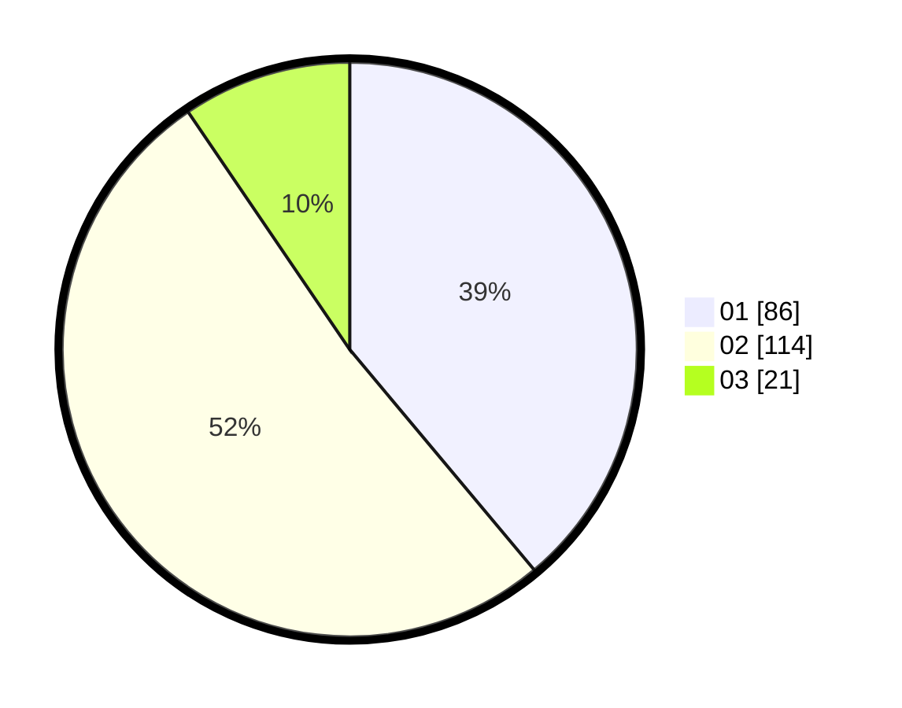

# Hasil

Hasil perolehan suara paslon dapat dilihat pada file paslon-01.txt, paslon-02.txt, dan paslon-03.txt.

Jika tidak ada, artinya data tersebut belum ada pada SIREKAP.

## Perolehan Suara

 * Paslon 01: **86**.
 * Paslon 02: **114**.
 * Paslon 03: **21**.

## Foto C Plano

https://sirekap-obj-formc.kpu.go.id/0cd7/pemilu/ppwp/31/74/04/10/04/3174041004095-20240214-185801--2ca5cd38-aa7d-4e50-93bb-75692435454a.jpg

https://sirekap-obj-formc.kpu.go.id/0cd7/pemilu/ppwp/31/74/04/10/04/3174041004095-20240214-185810--d7bce3e6-d761-4048-aa5e-1ab65eff7a67.jpg

https://sirekap-obj-formc.kpu.go.id/0cd7/pemilu/ppwp/31/74/04/10/04/3174041004095-20240214-185815--f552297f-860b-4db3-a640-702c91e1be35.jpg

## DATA PEMILIH TETAP

Jumlah pemilih dalam DPT: **275**.
 * L: **133**.
 * P: **142**.

## DATA PENGGUNA HAK PILIH

Jumlah pengguna hak pilih dalam DPT: **221**.
 * L: **109**.
 * P: **112**.

Jumlah pengguna hak pilih dalam DPTb: **2**.
 * L: **1**.
 * P: **1**.

Jumlah pengguna hak pilih dalam DPK: **1**.
 * L: **0**.
 * P: **1**.

Jumlah pengguna hak pilih: **224**.
 * L: **110**.
 * P: **114**.

## JUMLAH SUARA SAH DAN TIDAK SAH

JUMLAH SELURUH SUARA SAH: **221**.

JUMLAH SUARA TIDAK SAH: **3**.

JUMLAH SELURUH SUARA SAH DAN SUARA TIDAK SAH: **224**.
