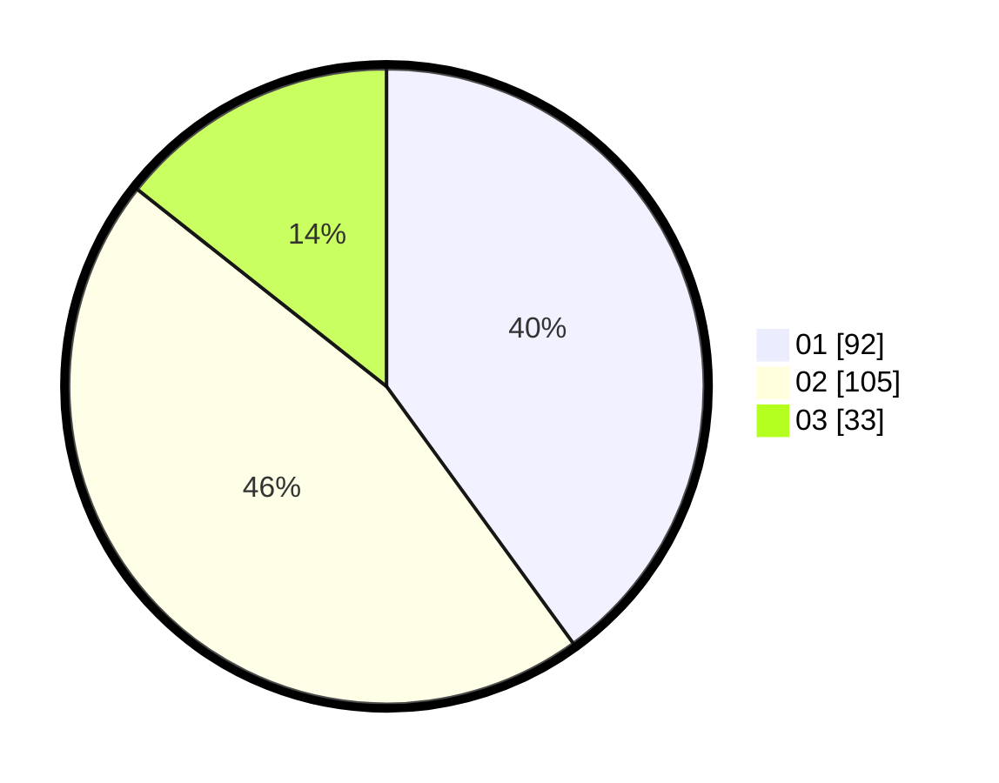

# Hasil

Hasil perolehan suara paslon dapat dilihat pada file paslon-01.txt, paslon-02.txt, dan paslon-03.txt.

Jika tidak ada, artinya data tersebut belum ada pada SIREKAP.

## Perolehan Suara

 * Paslon 01: **92**.
 * Paslon 02: **105**.
 * Paslon 03: **33**.

## Foto C Plano

https://sirekap-obj-formc.kpu.go.id/4c7c/pemilu/ppwp/31/74/04/10/04/3174041004100-20240216-052735--8fc66f39-3219-460a-97db-13d9380d7838.jpg

https://sirekap-obj-formc.kpu.go.id/4c7c/pemilu/ppwp/31/74/04/10/04/3174041004100-20240216-052737--5c0b931a-6ffd-4a57-a572-b8075b427be4.jpg

https://sirekap-obj-formc.kpu.go.id/4c7c/pemilu/ppwp/31/74/04/10/04/3174041004100-20240216-052736--88e634e6-b6b6-4be9-b1b8-cbbbadd8d25e.jpg

## DATA PEMILIH TETAP

Jumlah pemilih dalam DPT: **277**.
 * L: **145**.
 * P: **132**.

## DATA PENGGUNA HAK PILIH

Jumlah pengguna hak pilih dalam DPT: **227**.
 * L: **114**.
 * P: **113**.

Jumlah pengguna hak pilih dalam DPTb: **5**.
 * L: **1**.
 * P: **4**.

Jumlah pengguna hak pilih dalam DPK: **2**.
 * L: **0**.
 * P: **2**.

Jumlah pengguna hak pilih: **234**.
 * L: **115**.
 * P: **119**.

## JUMLAH SUARA SAH DAN TIDAK SAH

JUMLAH SELURUH SUARA SAH: **230**.

JUMLAH SUARA TIDAK SAH: **4**.

JUMLAH SELURUH SUARA SAH DAN SUARA TIDAK SAH: **234**.
