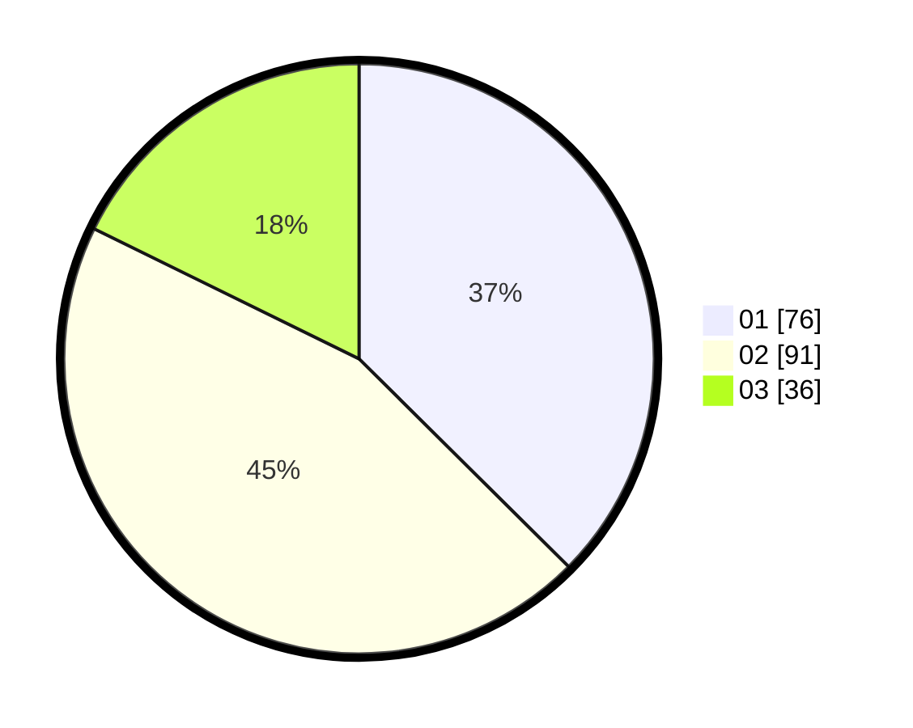

# Hasil

Hasil perolehan suara paslon dapat dilihat pada file paslon-01.txt, paslon-02.txt, dan paslon-03.txt.

Jika tidak ada, artinya data tersebut belum ada pada SIREKAP.

## Perolehan Suara

 * Paslon 01: **76**.
 * Paslon 02: **91**.
 * Paslon 03: **36**.

## Foto C Plano

https://sirekap-obj-formc.kpu.go.id/a976/pemilu/ppwp/31/74/04/10/04/3174041004105-20240216-133616--847b0a5f-4e7b-480c-8f22-e8e3b423b130.jpg

https://sirekap-obj-formc.kpu.go.id/a976/pemilu/ppwp/31/74/04/10/04/3174041004105-20240216-133617--d42b37c4-5bcb-4cf3-8935-ed01b20e477e.jpg

https://sirekap-obj-formc.kpu.go.id/a976/pemilu/ppwp/31/74/04/10/04/3174041004105-20240216-133616--1401d592-abf3-4652-835a-2a19f948d027.jpg

## DATA PEMILIH TETAP

Jumlah pemilih dalam DPT: **276**.
 * L: **142**.
 * P: **134**.

## DATA PENGGUNA HAK PILIH

Jumlah pengguna hak pilih dalam DPT: **206**.
 * L: **101**.
 * P: **105**.

Jumlah pengguna hak pilih dalam DPTb: **0**.
 * L: **0**.
 * P: **0**.

Jumlah pengguna hak pilih dalam DPK: **0**.
 * L: **0**.
 * P: **0**.

Jumlah pengguna hak pilih: **206**.
 * L: **101**.
 * P: **105**.

## JUMLAH SUARA SAH DAN TIDAK SAH

JUMLAH SELURUH SUARA SAH: **203**.

JUMLAH SUARA TIDAK SAH: **3**.

JUMLAH SELURUH SUARA SAH DAN SUARA TIDAK SAH: **206**.
