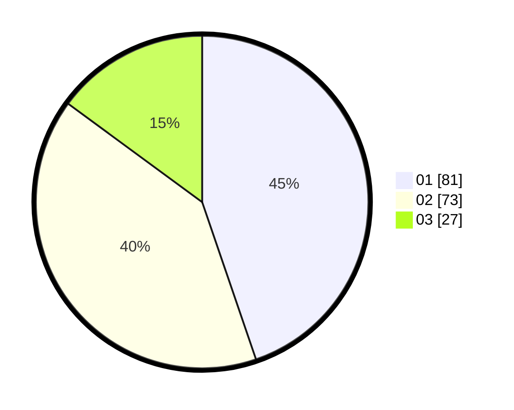

# Hasil

Hasil perolehan suara paslon dapat dilihat pada file paslon-01.txt, paslon-02.txt, dan paslon-03.txt.

Jika tidak ada, artinya data tersebut belum ada pada SIREKAP.

## Perolehan Suara

 * Paslon 01: **81**.
 * Paslon 02: **73**.
 * Paslon 03: **27**.

## Foto C Plano

https://sirekap-obj-formc.kpu.go.id/2992/pemilu/ppwp/31/74/04/10/04/3174041004111-20240214-194641--32cd73e8-d1c0-4295-b00d-5141778cdfa0.jpg

https://sirekap-obj-formc.kpu.go.id/2992/pemilu/ppwp/31/74/04/10/04/3174041004111-20240214-162246--6c89582b-47e5-4d0b-ad53-2cc25b1663eb.jpg

https://sirekap-obj-formc.kpu.go.id/2992/pemilu/ppwp/31/74/04/10/04/3174041004111-20240214-194649--314d9beb-bddb-425b-9775-1ac717f731de.jpg

## DATA PEMILIH TETAP

Jumlah pemilih dalam DPT: **216**.
 * L: **108**.
 * P: **108**.

## DATA PENGGUNA HAK PILIH

Jumlah pengguna hak pilih dalam DPT: **176**.
 * L: **89**.
 * P: **87**.

Jumlah pengguna hak pilih dalam DPTb: **1**.
 * L: **0**.
 * P: **1**.

Jumlah pengguna hak pilih dalam DPK: **4**.
 * L: **2**.
 * P: **2**.

Jumlah pengguna hak pilih: **181**.
 * L: **91**.
 * P: **90**.

## JUMLAH SUARA SAH DAN TIDAK SAH

JUMLAH SELURUH SUARA SAH: **181**.

JUMLAH SUARA TIDAK SAH: **0**.

JUMLAH SELURUH SUARA SAH DAN SUARA TIDAK SAH: **181**.
