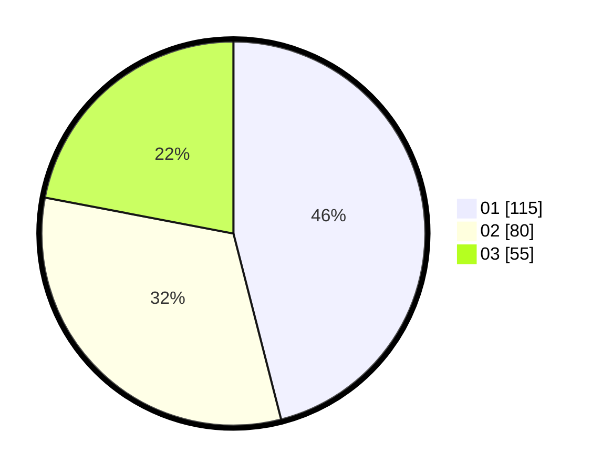

# Hasil

Hasil perolehan suara paslon dapat dilihat pada file paslon-01.txt, paslon-02.txt, dan paslon-03.txt.

Jika tidak ada, artinya data tersebut belum ada pada SIREKAP.

## Perolehan Suara

 * Paslon 01: **115**.
 * Paslon 02: **80**.
 * Paslon 03: **55**.

## Foto C Plano

https://sirekap-obj-formc.kpu.go.id/b864/pemilu/ppwp/31/74/04/10/04/3174041004116-20240214-193110--2b480580-a9ba-423f-a9c9-ead36e469ee7.jpg

https://sirekap-obj-formc.kpu.go.id/b864/pemilu/ppwp/31/74/04/10/04/3174041004116-20240214-191648--46099646-668e-41c9-a399-c97ebab7719e.jpg

https://sirekap-obj-formc.kpu.go.id/b864/pemilu/ppwp/31/74/04/10/04/3174041004116-20240214-191116--84f3205f-78c9-483e-a6dd-2101c58c605f.jpg

## DATA PEMILIH TETAP

Jumlah pemilih dalam DPT: **296**.
 * L: **154**.
 * P: **142**.

## DATA PENGGUNA HAK PILIH

Jumlah pengguna hak pilih dalam DPT: **247**.
 * L: **124**.
 * P: **123**.

Jumlah pengguna hak pilih dalam DPTb: **8**.
 * L: **2**.
 * P: **6**.

Jumlah pengguna hak pilih dalam DPK: **1**.
 * L: **0**.
 * P: **1**.

Jumlah pengguna hak pilih: **256**.
 * L: **126**.
 * P: **130**.

## JUMLAH SUARA SAH DAN TIDAK SAH

JUMLAH SELURUH SUARA SAH: **250**.

JUMLAH SUARA TIDAK SAH: **6**.

JUMLAH SELURUH SUARA SAH DAN SUARA TIDAK SAH: **256**.
