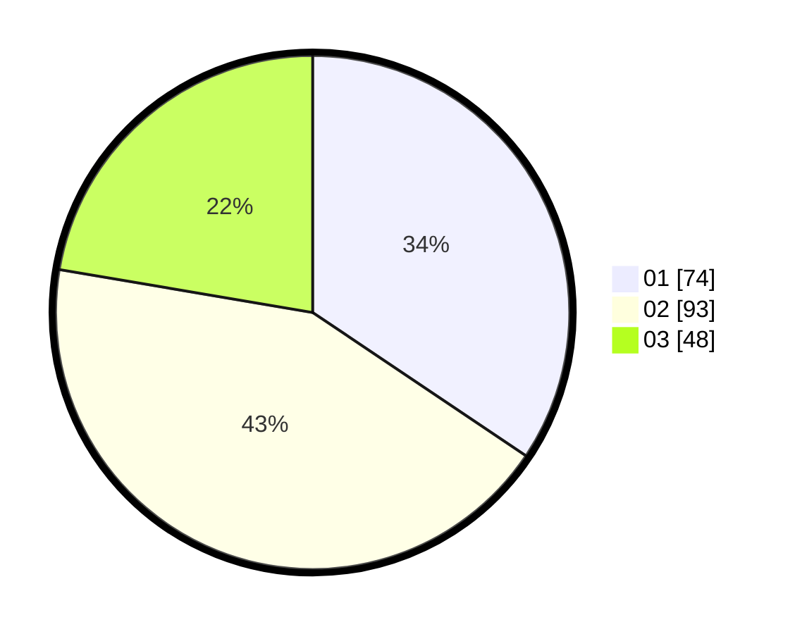

# Hasil

Hasil perolehan suara paslon dapat dilihat pada file paslon-01.txt, paslon-02.txt, dan paslon-03.txt.

Jika tidak ada, artinya data tersebut belum ada pada SIREKAP.

## Perolehan Suara

 * Paslon 01: **74**.
 * Paslon 02: **93**.
 * Paslon 03: **48**.

## Foto C Plano

https://sirekap-obj-formc.kpu.go.id/eb50/pemilu/ppwp/31/74/04/10/04/3174041004128-20240216-082550--8c8b1e4d-6e0b-4cd8-8f8b-d045a3c94e89.jpg

https://sirekap-obj-formc.kpu.go.id/eb50/pemilu/ppwp/31/74/04/10/04/3174041004128-20240216-082610--d1b93dac-a508-4736-9a45-360c32340e80.jpg

https://sirekap-obj-formc.kpu.go.id/eb50/pemilu/ppwp/31/74/04/10/04/3174041004128-20240216-092041--a3e41066-3393-498c-9dd4-dcaf1ffb6990.jpg

## DATA PEMILIH TETAP

Jumlah pemilih dalam DPT: **263**.
 * L: **132**.
 * P: **131**.

## DATA PENGGUNA HAK PILIH

Jumlah pengguna hak pilih dalam DPT: **193**.
 * L: **93**.
 * P: **100**.

Jumlah pengguna hak pilih dalam DPTb: **5**.
 * L: **1**.
 * P: **4**.

Jumlah pengguna hak pilih dalam DPK: **23**.
 * L: **15**.
 * P: **8**.

Jumlah pengguna hak pilih: **221**.
 * L: **109**.
 * P: **112**.

## JUMLAH SUARA SAH DAN TIDAK SAH

JUMLAH SELURUH SUARA SAH: **215**.

JUMLAH SUARA TIDAK SAH: **6**.

JUMLAH SELURUH SUARA SAH DAN SUARA TIDAK SAH: **221**.
