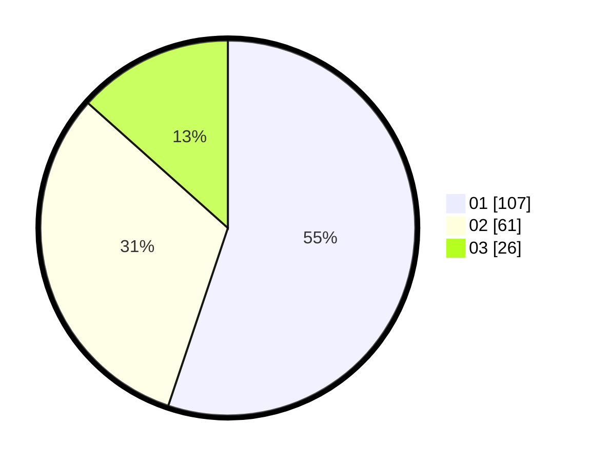

# Hasil

Hasil perolehan suara paslon dapat dilihat pada file paslon-01.txt, paslon-02.txt, dan paslon-03.txt.

Jika tidak ada, artinya data tersebut belum ada pada SIREKAP.

## Perolehan Suara

 * Paslon 01: **107**.
 * Paslon 02: **61**.
 * Paslon 03: **26**.

## Foto C Plano

https://sirekap-obj-formc.kpu.go.id/09d3/pemilu/ppwp/31/74/04/10/04/3174041004130-20240214-195416--34efe8a6-331b-4717-ac82-7adc21f52444.jpg

https://sirekap-obj-formc.kpu.go.id/09d3/pemilu/ppwp/31/74/04/10/04/3174041004130-20240214-193141--238135e3-facd-42cd-af4d-2f9d142d236e.jpg

https://sirekap-obj-formc.kpu.go.id/09d3/pemilu/ppwp/31/74/04/10/04/3174041004130-20240214-195548--f9e85975-365d-4f4b-b17a-7dccc7652f25.jpg

## DATA PEMILIH TETAP

Jumlah pemilih dalam DPT: **241**.
 * L: **111**.
 * P: **130**.

## DATA PENGGUNA HAK PILIH

Jumlah pengguna hak pilih dalam DPT: **189**.
 * L: **85**.
 * P: **104**.

Jumlah pengguna hak pilih dalam DPTb: **7**.
 * L: **5**.
 * P: **2**.

Jumlah pengguna hak pilih dalam DPK: **2**.
 * L: **2**.
 * P: **0**.

Jumlah pengguna hak pilih: **198**.
 * L: **92**.
 * P: **106**.

## JUMLAH SUARA SAH DAN TIDAK SAH

JUMLAH SELURUH SUARA SAH: **194**.

JUMLAH SUARA TIDAK SAH: **4**.

JUMLAH SELURUH SUARA SAH DAN SUARA TIDAK SAH: **198**.
