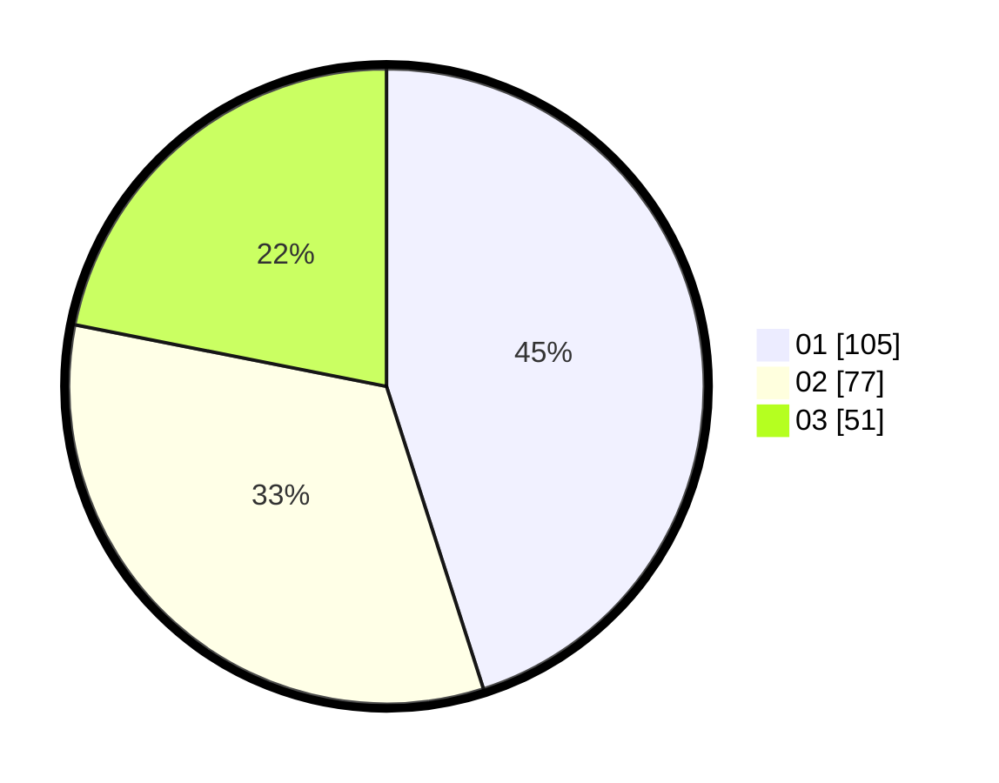

# Hasil

Hasil perolehan suara paslon dapat dilihat pada file paslon-01.txt, paslon-02.txt, dan paslon-03.txt.

Jika tidak ada, artinya data tersebut belum ada pada SIREKAP.

## Perolehan Suara

 * Paslon 01: **105**.
 * Paslon 02: **77**.
 * Paslon 03: **51**.

## Foto C Plano

https://sirekap-obj-formc.kpu.go.id/aa39/pemilu/ppwp/31/74/04/10/05/3174041005002-20240214-155354--457d7e45-77f4-443d-9678-f30c521afd23.jpg

https://sirekap-obj-formc.kpu.go.id/aa39/pemilu/ppwp/31/74/04/10/05/3174041005002-20240214-155417--af031e27-993b-4c4c-afa0-ff696d5931e3.jpg

https://sirekap-obj-formc.kpu.go.id/aa39/pemilu/ppwp/31/74/04/10/05/3174041005002-20240214-191645--3955ae26-d302-4262-8e72-7145d9853572.jpg

## DATA PEMILIH TETAP

Jumlah pemilih dalam DPT: **274**.
 * L: **128**.
 * P: **146**.

## DATA PENGGUNA HAK PILIH

Jumlah pengguna hak pilih dalam DPT: **222**.
 * L: **107**.
 * P: **115**.

Jumlah pengguna hak pilih dalam DPTb: **8**.
 * L: **2**.
 * P: **6**.

Jumlah pengguna hak pilih dalam DPK: **7**.
 * L: **1**.
 * P: **6**.

Jumlah pengguna hak pilih: **237**.
 * L: **110**.
 * P: **127**.

## JUMLAH SUARA SAH DAN TIDAK SAH

JUMLAH SELURUH SUARA SAH: **233**.

JUMLAH SUARA TIDAK SAH: **4**.

JUMLAH SELURUH SUARA SAH DAN SUARA TIDAK SAH: **237**.
