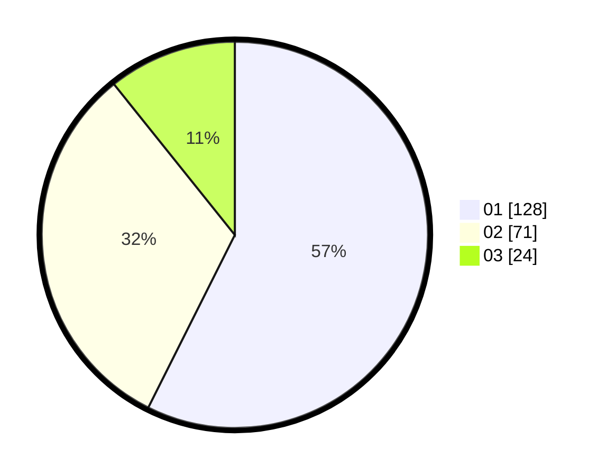

# Hasil

Hasil perolehan suara paslon dapat dilihat pada file paslon-01.txt, paslon-02.txt, dan paslon-03.txt.

Jika tidak ada, artinya data tersebut belum ada pada SIREKAP.

## Perolehan Suara

 * Paslon 01: **128**.
 * Paslon 02: **71**.
 * Paslon 03: **24**.

## Foto C Plano

https://sirekap-obj-formc.kpu.go.id/53be/pemilu/ppwp/31/74/04/10/05/3174041005020-20240214-155544--1892d3db-7cf6-4884-8de9-0c90ac65f9b4.jpg

https://sirekap-obj-formc.kpu.go.id/53be/pemilu/ppwp/31/74/04/10/05/3174041005020-20240214-155852--4d619443-5b92-4c11-b3e2-1bdbc48117e3.jpg

https://sirekap-obj-formc.kpu.go.id/53be/pemilu/ppwp/31/74/04/10/05/3174041005020-20240214-160056--b8f8f2d6-ffcb-4a6b-b373-5dc3c89e137e.jpg

## DATA PEMILIH TETAP

Jumlah pemilih dalam DPT: **265**.
 * L: **128**.
 * P: **137**.

## DATA PENGGUNA HAK PILIH

Jumlah pengguna hak pilih dalam DPT: **222**.
 * L: **105**.
 * P: **117**.

Jumlah pengguna hak pilih dalam DPTb: **5**.
 * L: **2**.
 * P: **3**.

Jumlah pengguna hak pilih dalam DPK: **1**.
 * L: **1**.
 * P: **0**.

Jumlah pengguna hak pilih: **228**.
 * L: **108**.
 * P: **120**.

## JUMLAH SUARA SAH DAN TIDAK SAH

JUMLAH SELURUH SUARA SAH: **223**.

JUMLAH SUARA TIDAK SAH: **5**.

JUMLAH SELURUH SUARA SAH DAN SUARA TIDAK SAH: **228**.
