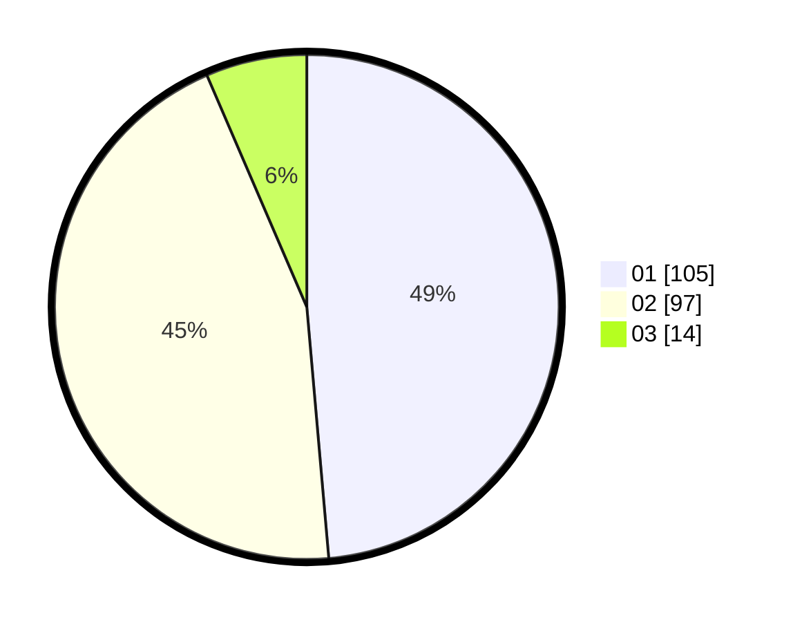

# Hasil

Hasil perolehan suara paslon dapat dilihat pada file paslon-01.txt, paslon-02.txt, dan paslon-03.txt.

Jika tidak ada, artinya data tersebut belum ada pada SIREKAP.

## Perolehan Suara

 * Paslon 01: **105**.
 * Paslon 02: **97**.
 * Paslon 03: **14**.

## Foto C Plano

https://sirekap-obj-formc.kpu.go.id/b10f/pemilu/ppwp/31/74/04/10/05/3174041005037-20240214-214103--0a81f7b5-91c3-4377-aa90-5918136dd1da.jpg

https://sirekap-obj-formc.kpu.go.id/b10f/pemilu/ppwp/31/74/04/10/05/3174041005037-20240214-200945--16ccd90c-96ac-484c-b879-647e021bdadb.jpg

https://sirekap-obj-formc.kpu.go.id/b10f/pemilu/ppwp/31/74/04/10/05/3174041005037-20240214-225059--9ae1c475-7dd1-416e-b35a-cbf9a84bc7c3.jpg

## DATA PEMILIH TETAP

Jumlah pemilih dalam DPT: **259**.
 * L: **126**.
 * P: **133**.

## DATA PENGGUNA HAK PILIH

Jumlah pengguna hak pilih dalam DPT: **215**.
 * L: **97**.
 * P: **118**.

Jumlah pengguna hak pilih dalam DPTb: **3**.
 * L: **1**.
 * P: **2**.

Jumlah pengguna hak pilih dalam DPK: **1**.
 * L: **1**.
 * P: **0**.

Jumlah pengguna hak pilih: **219**.
 * L: **99**.
 * P: **120**.

## JUMLAH SUARA SAH DAN TIDAK SAH

JUMLAH SELURUH SUARA SAH: **216**.

JUMLAH SUARA TIDAK SAH: **3**.

JUMLAH SELURUH SUARA SAH DAN SUARA TIDAK SAH: **219**.
