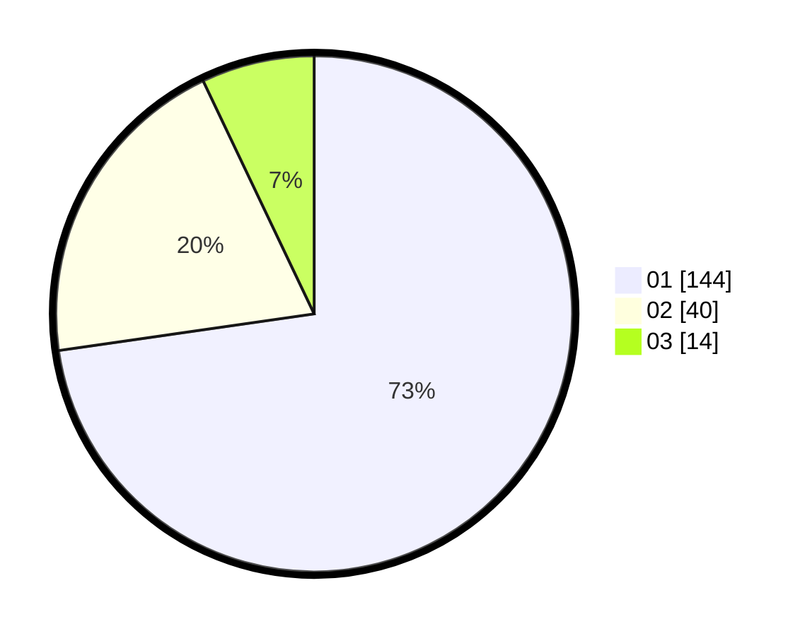

# Hasil

Hasil perolehan suara paslon dapat dilihat pada file paslon-01.txt, paslon-02.txt, dan paslon-03.txt.

Jika tidak ada, artinya data tersebut belum ada pada SIREKAP.

## Perolehan Suara

 * Paslon 01: **144**.
 * Paslon 02: **40**.
 * Paslon 03: **14**.

## Foto C Plano

https://sirekap-obj-formc.kpu.go.id/24d8/pemilu/ppwp/31/74/04/10/05/3174041005045-20240214-194546--87cf9c00-9fc4-42e4-8ae9-ab69356faed7.jpg

https://sirekap-obj-formc.kpu.go.id/24d8/pemilu/ppwp/31/74/04/10/05/3174041005045-20240214-194745--a392f8ec-c8aa-4d89-a2ad-d46c12630c11.jpg

https://sirekap-obj-formc.kpu.go.id/24d8/pemilu/ppwp/31/74/04/10/05/3174041005045-20240214-194959--1c28fe52-90a4-45c8-9588-e4288e7adfc2.jpg

## DATA PEMILIH TETAP

Jumlah pemilih dalam DPT: **257**.
 * L: **132**.
 * P: **125**.

## DATA PENGGUNA HAK PILIH

Jumlah pengguna hak pilih dalam DPT: **198**.
 * L: **99**.
 * P: **99**.

Jumlah pengguna hak pilih dalam DPTb: **2**.
 * L: **1**.
 * P: **1**.

Jumlah pengguna hak pilih dalam DPK: **1**.
 * L: **0**.
 * P: **1**.

Jumlah pengguna hak pilih: **201**.
 * L: **100**.
 * P: **101**.

## JUMLAH SUARA SAH DAN TIDAK SAH

JUMLAH SELURUH SUARA SAH: **198**.

JUMLAH SUARA TIDAK SAH: **3**.

JUMLAH SELURUH SUARA SAH DAN SUARA TIDAK SAH: **201**.
