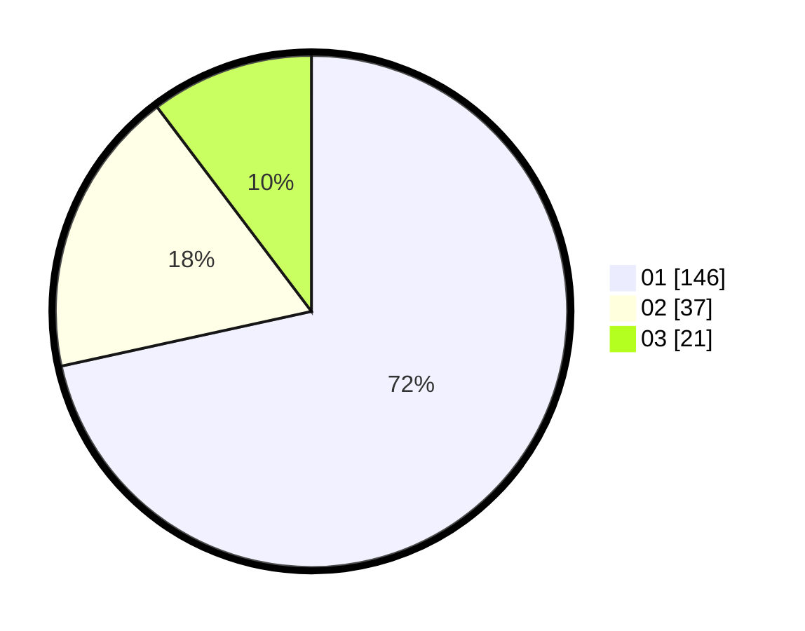

# Hasil

Hasil perolehan suara paslon dapat dilihat pada file paslon-01.txt, paslon-02.txt, dan paslon-03.txt.

Jika tidak ada, artinya data tersebut belum ada pada SIREKAP.

## Perolehan Suara

 * Paslon 01: **146**.
 * Paslon 02: **37**.
 * Paslon 03: **21**.

## Foto C Plano

https://sirekap-obj-formc.kpu.go.id/adf5/pemilu/ppwp/31/74/04/10/05/3174041005053-20240214-212955--41ab3a61-d257-4980-b8fc-4518195dd6c6.jpg

https://sirekap-obj-formc.kpu.go.id/adf5/pemilu/ppwp/31/74/04/10/05/3174041005053-20240214-225859--f1510117-15b4-4477-9a7e-0fc2ccf8c5c4.jpg

https://sirekap-obj-formc.kpu.go.id/adf5/pemilu/ppwp/31/74/04/10/05/3174041005053-20240214-213641--cef6c8d6-2b80-444a-9889-f4e9ee46fc0d.jpg

## DATA PEMILIH TETAP

Jumlah pemilih dalam DPT: **251**.
 * L: **114**.
 * P: **137**.

## DATA PENGGUNA HAK PILIH

Jumlah pengguna hak pilih dalam DPT: **207**.
 * L: **95**.
 * P: **112**.

Jumlah pengguna hak pilih dalam DPTb: **0**.
 * L: **0**.
 * P: **0**.

Jumlah pengguna hak pilih dalam DPK: **0**.
 * L: **0**.
 * P: **0**.

Jumlah pengguna hak pilih: **207**.
 * L: **95**.
 * P: **112**.

## JUMLAH SUARA SAH DAN TIDAK SAH

JUMLAH SELURUH SUARA SAH: **204**.

JUMLAH SUARA TIDAK SAH: **3**.

JUMLAH SELURUH SUARA SAH DAN SUARA TIDAK SAH: **207**.
