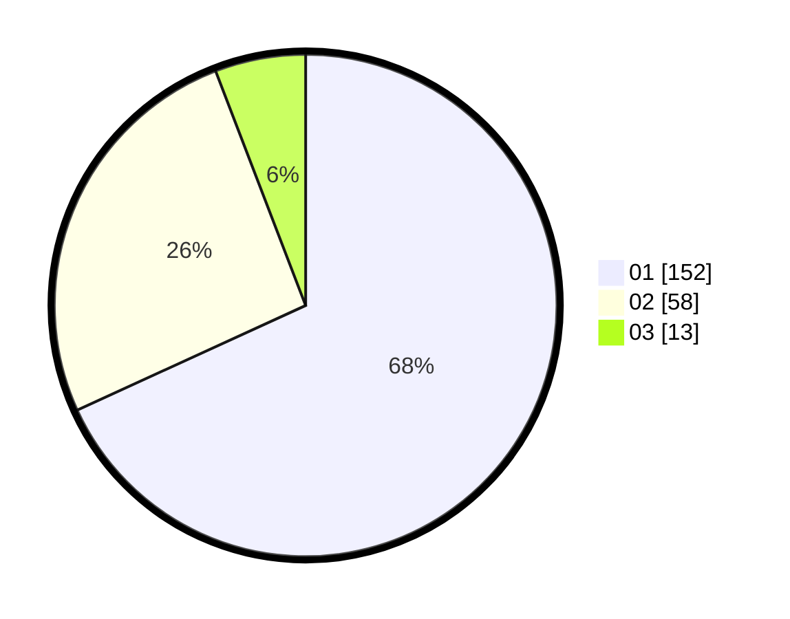

# Hasil

Hasil perolehan suara paslon dapat dilihat pada file paslon-01.txt, paslon-02.txt, dan paslon-03.txt.

Jika tidak ada, artinya data tersebut belum ada pada SIREKAP.

## Perolehan Suara

 * Paslon 01: **152**.
 * Paslon 02: **58**.
 * Paslon 03: **13**.

## Foto C Plano

https://sirekap-obj-formc.kpu.go.id/cd65/pemilu/ppwp/31/74/04/10/05/3174041005065-20240216-054215--4ec8beeb-d360-4f11-a119-2673dd497be7.jpg

https://sirekap-obj-formc.kpu.go.id/cd65/pemilu/ppwp/31/74/04/10/05/3174041005065-20240216-054216--65ff2efa-8012-4ced-9c0f-ebba79a60247.jpg

https://sirekap-obj-formc.kpu.go.id/cd65/pemilu/ppwp/31/74/04/10/05/3174041005065-20240216-054216--71db73e5-52c6-43c0-9dc4-4b5cd25fb7b7.jpg

## DATA PEMILIH TETAP

Jumlah pemilih dalam DPT: **261**.
 * L: **118**.
 * P: **143**.

## DATA PENGGUNA HAK PILIH

Jumlah pengguna hak pilih dalam DPT: **223**.
 * L: **100**.
 * P: **123**.

Jumlah pengguna hak pilih dalam DPTb: **0**.
 * L: **0**.
 * P: **0**.

Jumlah pengguna hak pilih dalam DPK: **1**.
 * L: **1**.
 * P: **0**.

Jumlah pengguna hak pilih: **224**.
 * L: **101**.
 * P: **123**.

## JUMLAH SUARA SAH DAN TIDAK SAH

JUMLAH SELURUH SUARA SAH: **223**.

JUMLAH SUARA TIDAK SAH: **1**.

JUMLAH SELURUH SUARA SAH DAN SUARA TIDAK SAH: **224**.
