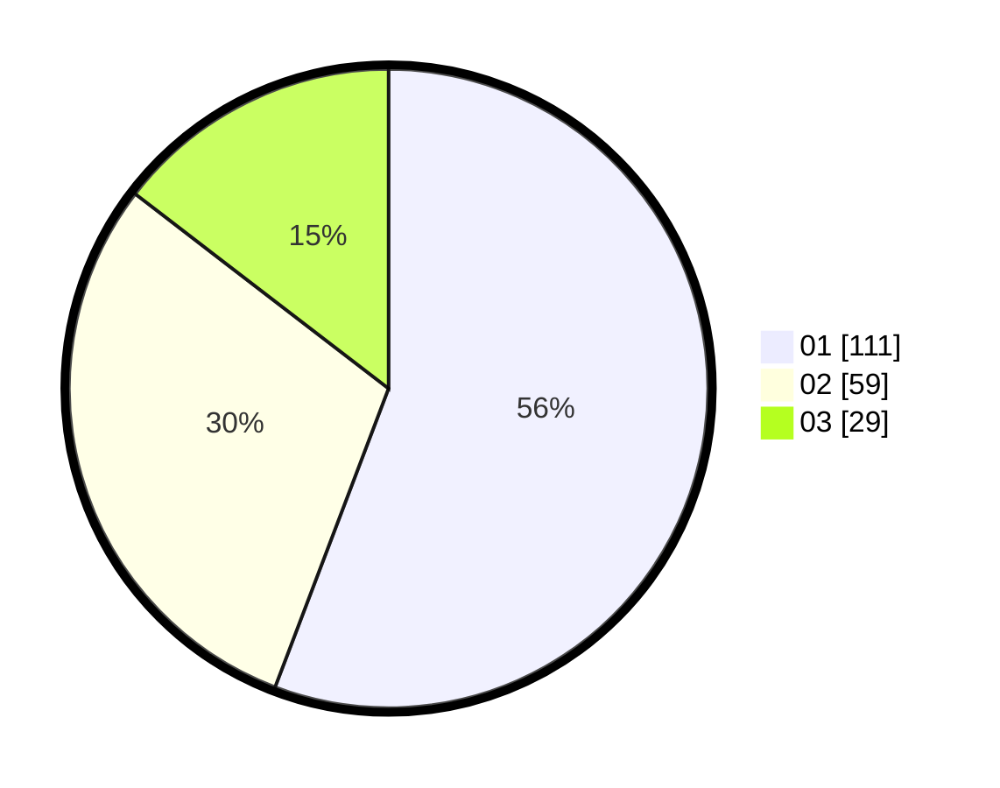

# Hasil

Hasil perolehan suara paslon dapat dilihat pada file paslon-01.txt, paslon-02.txt, dan paslon-03.txt.

Jika tidak ada, artinya data tersebut belum ada pada SIREKAP.

## Perolehan Suara

 * Paslon 01: **111**.
 * Paslon 02: **59**.
 * Paslon 03: **29**.

## Foto C Plano

https://sirekap-obj-formc.kpu.go.id/d62e/pemilu/ppwp/31/74/04/10/05/3174041005073-20240214-195153--709f94a8-b09a-4481-8679-485b64844cea.jpg

https://sirekap-obj-formc.kpu.go.id/d62e/pemilu/ppwp/31/74/04/10/05/3174041005073-20240214-193101--dbaed696-71db-43da-b9d1-d6c4350b5aac.jpg

https://sirekap-obj-formc.kpu.go.id/d62e/pemilu/ppwp/31/74/04/10/05/3174041005073-20240214-192905--3f24f7d5-1c5f-496c-bd07-3a984d7787b2.jpg

## DATA PEMILIH TETAP

Jumlah pemilih dalam DPT: **201**.
 * L: **84**.
 * P: **117**.

## DATA PENGGUNA HAK PILIH

Jumlah pengguna hak pilih dalam DPT: **201**.
 * L: **84**.
 * P: **117**.

Jumlah pengguna hak pilih dalam DPTb: **0**.
 * L: **0**.
 * P: **0**.

Jumlah pengguna hak pilih dalam DPK: **0**.
 * L: **0**.
 * P: **0**.

Jumlah pengguna hak pilih: **201**.
 * L: **84**.
 * P: **117**.

## JUMLAH SUARA SAH DAN TIDAK SAH

JUMLAH SELURUH SUARA SAH: **199**.

JUMLAH SUARA TIDAK SAH: **2**.

JUMLAH SELURUH SUARA SAH DAN SUARA TIDAK SAH: **201**.
