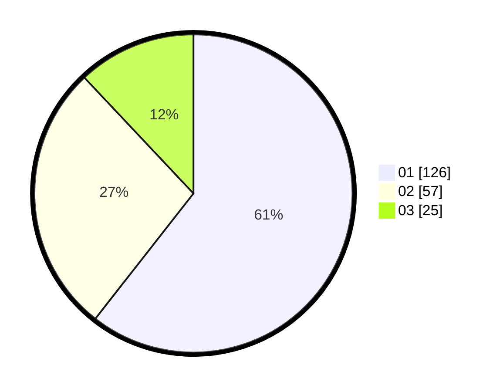

# Hasil

Hasil perolehan suara paslon dapat dilihat pada file paslon-01.txt, paslon-02.txt, dan paslon-03.txt.

Jika tidak ada, artinya data tersebut belum ada pada SIREKAP.

## Perolehan Suara

 * Paslon 01: **126**.
 * Paslon 02: **57**.
 * Paslon 03: **25**.

## Foto C Plano

https://sirekap-obj-formc.kpu.go.id/b4d2/pemilu/ppwp/31/74/04/10/05/3174041005079-20240214-195625--18c7b7da-e6f9-488a-a5ca-aca33549be92.jpg

https://sirekap-obj-formc.kpu.go.id/b4d2/pemilu/ppwp/31/74/04/10/05/3174041005079-20240214-184604--455b83ec-280b-4e7c-a248-214a01a5f561.jpg

https://sirekap-obj-formc.kpu.go.id/b4d2/pemilu/ppwp/31/74/04/10/05/3174041005079-20240214-184608--cd48279b-1909-4e0b-8580-2c2fd127aabd.jpg

## DATA PEMILIH TETAP

Jumlah pemilih dalam DPT: **263**.
 * L: **130**.
 * P: **133**.

## DATA PENGGUNA HAK PILIH

Jumlah pengguna hak pilih dalam DPT: **202**.
 * L: **98**.
 * P: **104**.

Jumlah pengguna hak pilih dalam DPTb: **0**.
 * L: **0**.
 * P: **0**.

Jumlah pengguna hak pilih dalam DPK: **6**.
 * L: **4**.
 * P: **2**.

Jumlah pengguna hak pilih: **208**.
 * L: **102**.
 * P: **106**.

## JUMLAH SUARA SAH DAN TIDAK SAH

JUMLAH SELURUH SUARA SAH: **208**.

JUMLAH SUARA TIDAK SAH: **1**.

JUMLAH SELURUH SUARA SAH DAN SUARA TIDAK SAH: **209**.
