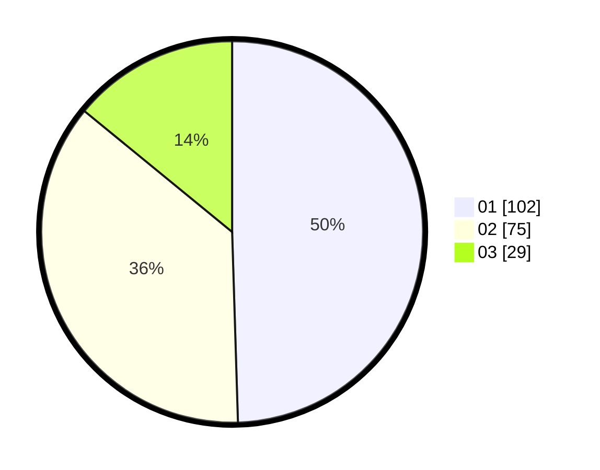

# Hasil

Hasil perolehan suara paslon dapat dilihat pada file paslon-01.txt, paslon-02.txt, dan paslon-03.txt.

Jika tidak ada, artinya data tersebut belum ada pada SIREKAP.

## Perolehan Suara

 * Paslon 01: **102**.
 * Paslon 02: **75**.
 * Paslon 03: **29**.

## Foto C Plano

https://sirekap-obj-formc.kpu.go.id/4953/pemilu/ppwp/31/74/04/10/05/3174041005092-20240215-003349--0efeee40-f020-47ec-991f-ab575ce4fb74.jpg

https://sirekap-obj-formc.kpu.go.id/4953/pemilu/ppwp/31/74/04/10/05/3174041005092-20240215-003536--51d3144b-562e-46f4-8a35-dde55c3bb288.jpg

https://sirekap-obj-formc.kpu.go.id/4953/pemilu/ppwp/31/74/04/10/05/3174041005092-20240215-003629--993a9e1a-e812-4b5d-acc9-2a6257420eb9.jpg

## DATA PEMILIH TETAP

Jumlah pemilih dalam DPT: **266**.
 * L: **126**.
 * P: **140**.

## DATA PENGGUNA HAK PILIH

Jumlah pengguna hak pilih dalam DPT: **215**.
 * L: **100**.
 * P: **115**.

Jumlah pengguna hak pilih dalam DPTb: **2**.
 * L: **1**.
 * P: **1**.

Jumlah pengguna hak pilih dalam DPK: **2**.
 * L: **0**.
 * P: **2**.

Jumlah pengguna hak pilih: **219**.
 * L: **101**.
 * P: **118**.

## JUMLAH SUARA SAH DAN TIDAK SAH

JUMLAH SELURUH SUARA SAH: **206**.

JUMLAH SUARA TIDAK SAH: **13**.

JUMLAH SELURUH SUARA SAH DAN SUARA TIDAK SAH: **219**.
