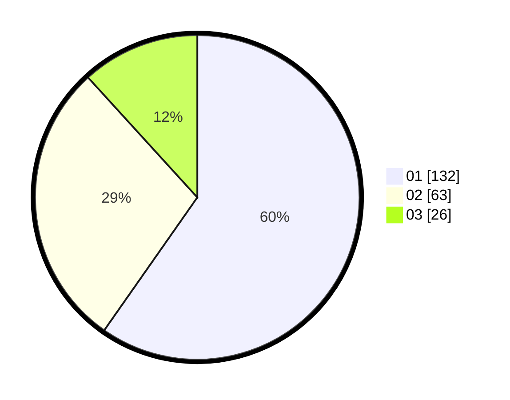

# Hasil

Hasil perolehan suara paslon dapat dilihat pada file paslon-01.txt, paslon-02.txt, dan paslon-03.txt.

Jika tidak ada, artinya data tersebut belum ada pada SIREKAP.

## Perolehan Suara

 * Paslon 01: **132**.
 * Paslon 02: **63**.
 * Paslon 03: **26**.

## Foto C Plano

https://sirekap-obj-formc.kpu.go.id/1876/pemilu/ppwp/31/74/04/10/05/3174041005099-20240214-155310--6dbd8f99-62ad-460a-91e6-4b76d8bff6f4.jpg

https://sirekap-obj-formc.kpu.go.id/1876/pemilu/ppwp/31/74/04/10/05/3174041005099-20240214-155314--c08b1e81-5c98-4dd4-ba9a-a5c9aa49e1fc.jpg

https://sirekap-obj-formc.kpu.go.id/1876/pemilu/ppwp/31/74/04/10/05/3174041005099-20240214-155319--c6428fab-b750-48e2-bca1-747502f43d82.jpg

## DATA PEMILIH TETAP

Jumlah pemilih dalam DPT: **270**.
 * L: **137**.
 * P: **133**.

## DATA PENGGUNA HAK PILIH

Jumlah pengguna hak pilih dalam DPT: **221**.
 * L: **101**.
 * P: **120**.

Jumlah pengguna hak pilih dalam DPTb: **1**.
 * L: **1**.
 * P: **0**.

Jumlah pengguna hak pilih dalam DPK: **3**.
 * L: **2**.
 * P: **1**.

Jumlah pengguna hak pilih: **225**.
 * L: **103**.
 * P: **121**.

## JUMLAH SUARA SAH DAN TIDAK SAH

JUMLAH SELURUH SUARA SAH: **221**.

JUMLAH SUARA TIDAK SAH: **4**.

JUMLAH SELURUH SUARA SAH DAN SUARA TIDAK SAH: **225**.
