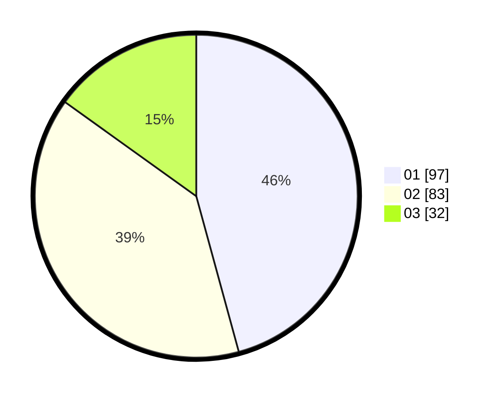

# Hasil

Hasil perolehan suara paslon dapat dilihat pada file paslon-01.txt, paslon-02.txt, dan paslon-03.txt.

Jika tidak ada, artinya data tersebut belum ada pada SIREKAP.

## Perolehan Suara

 * Paslon 01: **97**.
 * Paslon 02: **83**.
 * Paslon 03: **32**.

## Foto C Plano

https://sirekap-obj-formc.kpu.go.id/8821/pemilu/ppwp/31/74/04/10/05/3174041005114-20240216-040807--5284bf96-7673-4f0d-9e1f-e3b896cc1e51.jpg

https://sirekap-obj-formc.kpu.go.id/8821/pemilu/ppwp/31/74/04/10/05/3174041005114-20240216-040820--f89305ce-f442-4e50-bead-ca4beb7d9bfe.jpg

https://sirekap-obj-formc.kpu.go.id/8821/pemilu/ppwp/31/74/04/10/05/3174041005114-20240216-040810--6a6f6336-0112-4853-8bb1-69332e46fa60.jpg

## DATA PEMILIH TETAP

Jumlah pemilih dalam DPT: **281**.
 * L: **137**.
 * P: **144**.

## DATA PENGGUNA HAK PILIH

Jumlah pengguna hak pilih dalam DPT: **211**.
 * L: **97**.
 * P: **114**.

Jumlah pengguna hak pilih dalam DPTb: **2**.
 * L: **1**.
 * P: **1**.

Jumlah pengguna hak pilih dalam DPK: **1**.
 * L: **1**.
 * P: **0**.

Jumlah pengguna hak pilih: **214**.
 * L: **99**.
 * P: **115**.

## JUMLAH SUARA SAH DAN TIDAK SAH

JUMLAH SELURUH SUARA SAH: **212**.

JUMLAH SUARA TIDAK SAH: **2**.

JUMLAH SELURUH SUARA SAH DAN SUARA TIDAK SAH: **214**.
