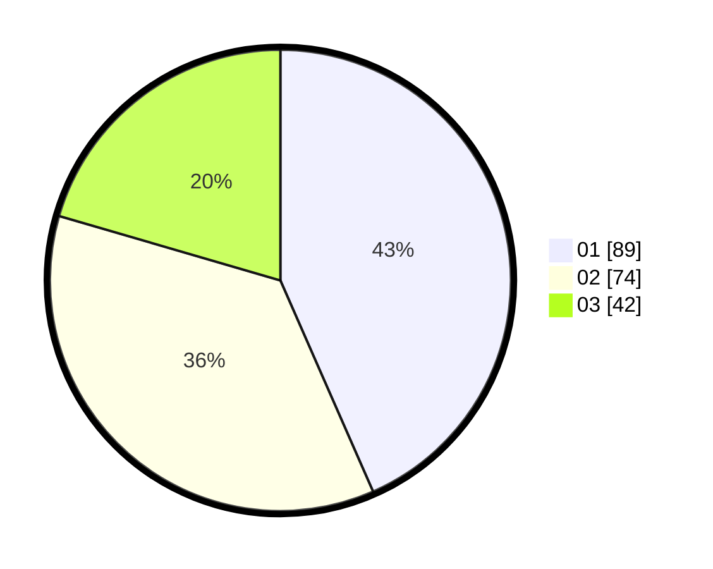

# Hasil

Hasil perolehan suara paslon dapat dilihat pada file paslon-01.txt, paslon-02.txt, dan paslon-03.txt.

Jika tidak ada, artinya data tersebut belum ada pada SIREKAP.

## Perolehan Suara

 * Paslon 01: **89**.
 * Paslon 02: **74**.
 * Paslon 03: **42**.

## Foto C Plano

https://sirekap-obj-formc.kpu.go.id/ce92/pemilu/ppwp/31/74/04/10/05/3174041005132-20240215-023149--2161d88f-de13-4128-851a-d84a1483abc5.jpg

https://sirekap-obj-formc.kpu.go.id/ce92/pemilu/ppwp/31/74/04/10/05/3174041005132-20240215-023254--f4baa9cd-956f-4b99-861f-e582f1b613a0.jpg

https://sirekap-obj-formc.kpu.go.id/ce92/pemilu/ppwp/31/74/04/10/05/3174041005132-20240215-023342--71971d3b-c11f-45ba-9099-74f0396a329a.jpg

## DATA PEMILIH TETAP

Jumlah pemilih dalam DPT: **255**.
 * L: **115**.
 * P: **140**.

## DATA PENGGUNA HAK PILIH

Jumlah pengguna hak pilih dalam DPT: **206**.
 * L: **88**.
 * P: **118**.

Jumlah pengguna hak pilih dalam DPTb: **3**.
 * L: **0**.
 * P: **3**.

Jumlah pengguna hak pilih dalam DPK: **0**.
 * L: **0**.
 * P: **0**.

Jumlah pengguna hak pilih: **209**.
 * L: **88**.
 * P: **121**.

## JUMLAH SUARA SAH DAN TIDAK SAH

JUMLAH SELURUH SUARA SAH: **205**.

JUMLAH SUARA TIDAK SAH: **4**.

JUMLAH SELURUH SUARA SAH DAN SUARA TIDAK SAH: **209**.
