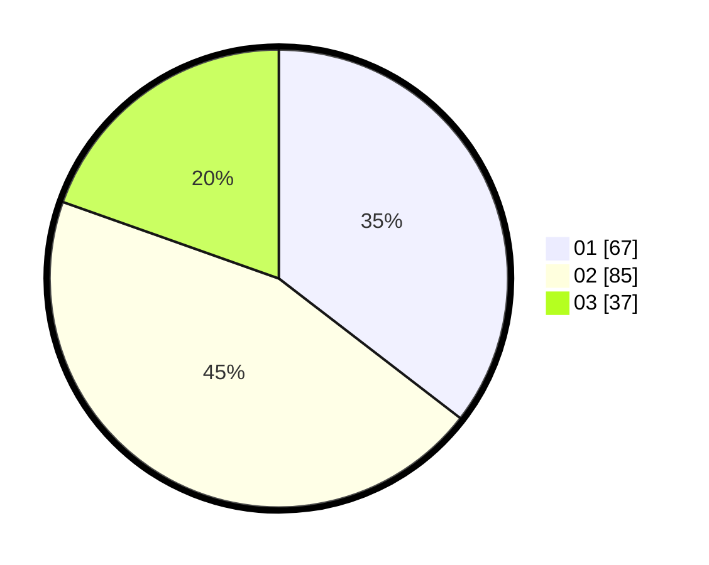

# Hasil

Hasil perolehan suara paslon dapat dilihat pada file paslon-01.txt, paslon-02.txt, dan paslon-03.txt.

Jika tidak ada, artinya data tersebut belum ada pada SIREKAP.

## Perolehan Suara

 * Paslon 01: **67**.
 * Paslon 02: **85**.
 * Paslon 03: **37**.

## Foto C Plano

https://sirekap-obj-formc.kpu.go.id/1e8e/pemilu/ppwp/31/74/04/10/05/3174041005136-20240217-083405--2ef39883-dd6c-4f52-a70d-5813181e13d4.jpg

https://sirekap-obj-formc.kpu.go.id/1e8e/pemilu/ppwp/31/74/04/10/05/3174041005136-20240217-101635--4ff5cafe-f99b-48f1-b555-ac5a6f98e541.jpg

https://sirekap-obj-formc.kpu.go.id/1e8e/pemilu/ppwp/31/74/04/10/05/3174041005136-20240217-102357--39788890-581f-4e28-aac7-27019c7c9632.jpg

## DATA PEMILIH TETAP

Jumlah pemilih dalam DPT: **244**.
 * L: **125**.
 * P: **119**.

## DATA PENGGUNA HAK PILIH

Jumlah pengguna hak pilih dalam DPT: **189**.
 * L: **97**.
 * P: **92**.

Jumlah pengguna hak pilih dalam DPTb: **3**.
 * L: **2**.
 * P: **1**.

Jumlah pengguna hak pilih dalam DPK: **1**.
 * L: **1**.
 * P: **0**.

Jumlah pengguna hak pilih: **193**.
 * L: **100**.
 * P: **93**.

## JUMLAH SUARA SAH DAN TIDAK SAH

JUMLAH SELURUH SUARA SAH: **189**.

JUMLAH SUARA TIDAK SAH: **4**.

JUMLAH SELURUH SUARA SAH DAN SUARA TIDAK SAH: **193**.
